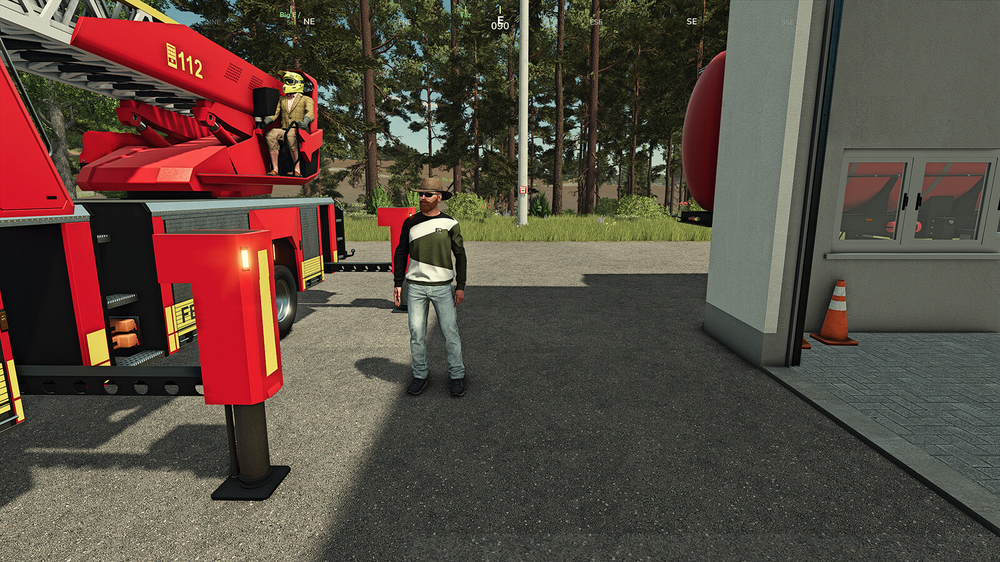
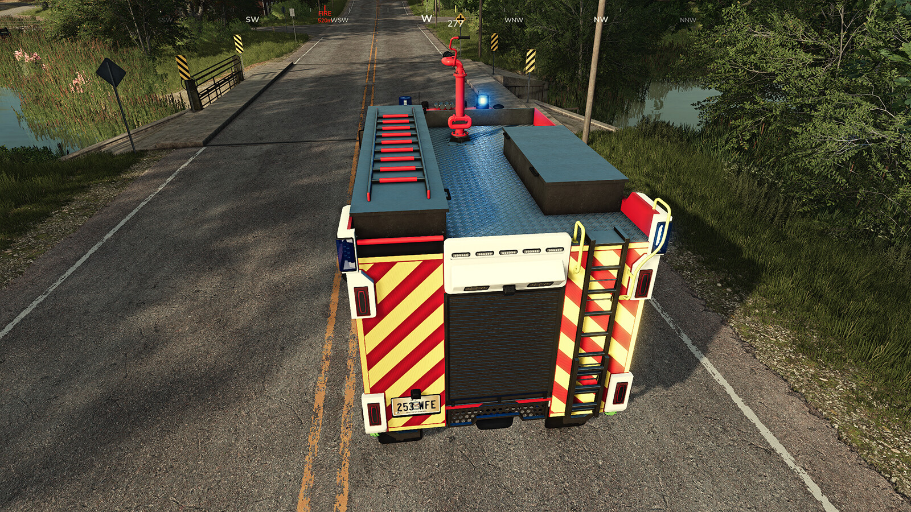
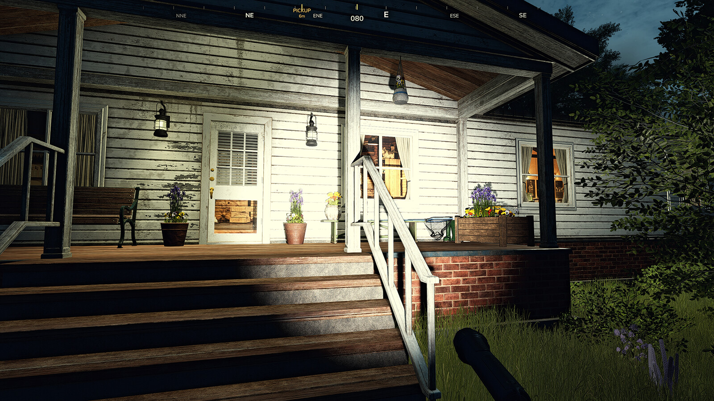

# FS25_CompassHeading — Compass Heading Display

**Version:** 1.0.0.0
**Author:** RocklandUSA Gaming
**Platform:** Farming Simulator 25
**Multiplayer:** Fully supported

### [⬇ Download Compass Heading Display on the GIANTS ModHub](https://www.farming-simulator.com/mod.php?mod_id=355722)

*Approved and live on the official GIANTS ModHub — install directly in-game or via the link above.*

---

## Overview

Compass Heading Display adds a smooth, real-time horizontal compass bar to the top of the screen. Inspired by the navigation HUDs found in GTA RP and military flight simulators, it gives you constant directional awareness without pausing or opening the map.

The compass scrolls fluidly as you turn, showing a full 16-point compass rose with degree tick marks, a gold centre indicator with numeric heading, and automatic markers for map waypoints and other players in multiplayer.

<p align="center">
  
</p>

Compass Heading is also a **platform** — it publishes a comprehensive public API (`g_currentMission.compassHeading`) with 60+ functions that any third-party mod can use to display markers, query navigation data, control settings, and receive events. No dependency is required.

<table align="center">
  <tr>
    <td align="center" width="50%">
      <br>
      <sub>On-foot RP scenes — works anywhere on the map.</sub>
    </td>
    <td align="center" width="50%">
      <br>
      <sub>Vehicle navigation — keeps your bearing without opening the map.</sub>
    </td>
  </tr>
  <tr>
    <td align="center" width="50%">
      <br>
      <sub>Third-party markers — any mod can add its own with a few lines of Lua.</sub>
    </td>
    <td align="center" width="50%">
      <br>
      <sub>Severe weather tracking — flashing red tornado marker with live distance.</sub>
    </td>
  </tr>
</table>

---

## Features

- **16-point compass rose** — N, NNE, NE, ENE, E, ESE, SE, SSE, S, SSW, SW, WSW, W, WNW, NW, NNW
- **Degree tick marks** — every 10 degrees for fine orientation
- **Gold centre indicator** — always visible at the top of the bar
- **Numeric heading readout** — live 0-359 degree display below the bar
- **Map waypoint tracking** — set a destination on the in-game map and an orange marker with distance appears on the compass bar
- **Multiplayer player markers** — other players shown as named cyan markers with distance
- **13 marker styles** — tick, diamond, triangle, circle, square, chevron, star, cross, dot, arrow, dash, exclaim, and more
- **14 default categories** — emergency, delivery, equipment, farm, activity, player, waypoint, shop, medical, police, fire, mechanic, custom, default
- **Animation engine** — flash, pulse, fade-in, and urgent mode per marker
- **Event system** — callbacks for marker enter/exit view, compass toggle, provider registration, marker lifecycle
- **Distance filtering** — auto-hide markers beyond maxDistance or within minDistance
- **Third-party mod integration** — open registry API and full standalone marker API
- **Edge arrows** — when a marker is outside the visible arc, a directional arrow appears at the bar edge
- **Dark background overlay** — adjustable opacity for readability in any lighting
- **Fully customizable** — every element can be toggled, repositioned, resized, and recoloured via an XML settings file
- **Runtime settings API** — change any setting live without restarting the game
- **Zero dependencies** — works standalone, no other mods required
- **Multiplayer safe** — each client renders its own compass independently
- **Dedicated server safe** — no rendering occurs; mod is harmless on servers

---

## Installation

Compass Heading Display is distributed exclusively through the official **GIANTS ModHub**.

1. Open the in-game Mod Hub menu in Farming Simulator 25, search for **Compass Heading Display**, and subscribe — or download the mod zip directly from the [Compass Heading Display ModHub page](https://www.farming-simulator.com/mod.php?mod_id=355722) and place it (do not extract) into your mods folder at `Documents\My Games\FarmingSimulator2025\mods\`.
2. Launch the game and enable the mod in the mod menu.
3. The compass bar appears automatically when you load a map.

**This repository contains documentation and issue tracking only.** The mod source code is closed and is not distributed outside of ModHub. Pull requests to add code will not be accepted.

---

## Configuration

On first launch the mod creates a settings file at:

```
Documents\My Games\FarmingSimulator2025\modSettings\FS25_CompassHeading\settings.xml
```

Edit this file with any text editor while the game is closed. All changes take effect on the next map load. Settings can also be changed at runtime via the API.

### Layout Settings

| Setting | Default | Description |
|---|---|---|
| `barPositionX` | 0.500 | Horizontal centre of the bar (0.0 = left edge, 1.0 = right edge) |
| `barWidth` | 0.680 | Total width of the bar (0.0-1.0 fraction of screen width) |
| `barVerticalY` | 0.974 | Vertical centre of the bar (0.0 = bottom, 1.0 = top) |
| `fieldOfView` | 160 | Degrees of compass visible at once (wider = more compressed) |
| `backgroundOpacity` | 0.62 | Opacity of the dark background behind the bar (0.0 = invisible, 1.0 = solid black) |

### Element Visibility

| Setting | Default | Description |
|---|---|---|
| `enabled` | true | Master on/off switch for the entire compass |
| `showCardinalLabels` | true | Show N, E, S, W labels |
| `showIntercardinalLabels` | true | Show NE, NW, SE, SW labels |
| `showMinorLabels` | true | Show NNE, ENE, ESE, SSE, SSW, WSW, WNW, NNW labels |
| `showTickMarks` | true | Show 10-degree tick marks |
| `showCenterIndicator` | true | Show the gold centre marker |
| `showDegreeReadout` | true | Show the numeric heading (e.g. 358) below the bar |
| `showPlayerMarkers` | true | Show other players in multiplayer |
| `showWaypointMarker` | true | Show the map navigation waypoint |

### Colour Settings

All colours use RGBA format with values from 0.0 to 1.0 per channel.

| Setting | Default | Description |
|---|---|---|
| `colCenterIndicator` | Gold (1.00, 0.85, 0.15, 1.00) | Colour of the centre marker |
| `colDegreeReadout` | White 50% (1.00, 1.00, 1.00, 0.50) | Colour of the numeric heading text |
| `colCardinal` | White (1.00, 1.00, 1.00, 1.00) | Colour of N, E, S, W labels |
| `colIntercardinal` | Light grey (0.88, 0.88, 0.88, 1.00) | Colour of NE, NW, SE, SW labels |
| `colMinor` | Medium grey (0.65, 0.65, 0.65, 1.00) | Colour of NNE, ENE, etc. labels |
| `colPlayerMarker` | Cyan (0.25, 0.88, 1.00, 1.00) | Colour of multiplayer player markers |
| `colWaypointMarker` | Orange (1.00, 0.55, 0.05, 1.00) | Colour of the map waypoint marker |

---

## Multiplayer

In multiplayer, each client renders its own compass bar independently. Other players appear as named cyan markers showing their distance from you. This makes it easy to find teammates or coordinate work across large maps without opening the map screen.

Player markers are based on vehicle position (when driving) or on-foot position. The displayed name comes from the game's user manager.

---

## Public API Reference

The full API is published at `g_currentMission.compassHeading` after map load. The backward-compatible registry remains at `g_currentMission.compassHeadingRegistry`.

### Quick Start

```lua
-- Check if Compass Heading is available
local ch = g_currentMission and g_currentMission.compassHeading
if ch == nil then return end  -- mod not installed, silent no-op

-- Add a marker
ch.addMarker("my_fire_01", {
    x = 500, z = 300,
    label = "FIRE",
    category = "emergency",
    style = "exclaim",
    flash = true,
    maxDistance = 2000,
})

-- Remove it later
ch.removeMarker("my_fire_01")

-- Get current heading
local bearing = ch.getBearing()
print("Heading: " .. bearing .. " (" .. ch.getCardinalDirection(bearing) .. ")")
```

### Safe Access Pattern

```lua
local function getCompassAPI()
    if g_currentMission and g_currentMission.compassHeading then
        return g_currentMission.compassHeading
    end
    return nil
end
```

If Compass Heading is not installed, all API calls are simply unavailable. No errors, no dependency declaration needed.

---

### System Status

| Function | Returns | Description |
|---|---|---|
| `isReady()` | boolean | True if the compass is loaded and operational |
| `getVersion()` | string | Version string (e.g. "1.8.0.0") |
| `setEnabled(bool)` | — | Enable or disable the entire compass |
| `isEnabled()` | boolean | Whether the compass is currently enabled |

---

### Standalone Marker Lifecycle

Add, update, and remove markers that persist until explicitly removed or until their TTL expires.

#### addMarker(id, opts)

| Parameter | Type | Required | Description |
|---|---|---|---|
| `id` | string | Yes | Unique marker ID |
| `opts.x` | number | Yes | World X coordinate |
| `opts.z` | number | Yes | World Z coordinate |
| `opts.label` | string | No | Short tag shown on bar (max 8 chars) |
| `opts.color` | table | No | `{r, g, b, a}` — defaults to category colour |
| `opts.style` | string | No | Marker glyph style (default: "tick") |
| `opts.scale` | number | No | Size multiplier (default: 1.0) |
| `opts.priority` | number | No | Draw order — higher draws on top (default: 0) |
| `opts.category` | string | No | Category name (default: "default") |
| `opts.maxDistance` | number | No | Hide when player is farther than this (meters) |
| `opts.minDistance` | number | No | Hide when player is closer than this (meters) |
| `opts.flash` | boolean | No | Enable square-wave visibility toggle |
| `opts.flashHz` | number | No | Flash frequency in Hz (default: 2.0) |
| `opts.pulse` | boolean | No | Enable sine-wave alpha oscillation |
| `opts.pulseHz` | number | No | Pulse frequency in Hz (default: 1.0) |
| `opts.pulseMin` | number | No | Minimum pulse alpha (default: 0.3) |
| `opts.pulseMax` | number | No | Maximum pulse alpha (default: 1.0) |
| `opts.fadeIn` | boolean | No | Enable alpha fade-in on creation |
| `opts.fadeInDur` | number | No | Fade-in duration in seconds (default: 0.5) |
| `opts.urgent` | boolean | No | Flash + colour shift toward red |
| `opts.ttl` | number | No | Auto-remove after this many seconds (0 = permanent) |

Returns `true` on success, `false` on failure.

#### Other Marker Functions

| Function | Returns | Description |
|---|---|---|
| `addTemporaryMarker(id, opts)` | boolean | Like addMarker but defaults TTL to 10 seconds |
| `removeMarker(id)` | boolean | Remove a standalone marker |
| `updateMarker(id, fields)` | boolean | Update specific fields of an existing marker |
| `getMarker(id)` | table/nil | Get a copy of marker data (excludes internal fields) |
| `hasMarker(id)` | boolean | Check if a marker exists |
| `clearMarkers(category?)` | number | Remove all markers, or all in a category. Returns count removed |

#### Convenience Shortcuts

| Function | Returns | Description |
|---|---|---|
| `setMarkerColor(id, {r,g,b,a})` | boolean | Change marker colour |
| `setMarkerLabel(id, text)` | boolean | Change marker label |
| `setMarkerStyle(id, style)` | boolean | Change marker glyph style |
| `setMarkerPosition(id, x, z)` | boolean | Move marker to new coordinates |
| `setMarkerFlash(id, enabled, hz?)` | boolean | Toggle flash animation |
| `setMarkerPulse(id, enabled, hz?, min?, max?)` | boolean | Toggle pulse animation |
| `setMarkerUrgent(id, enabled)` | boolean | Toggle urgent mode |

---

### Marker Styles

Available style names for the `style` parameter:

| Style | Glyph | Description |
|---|---|---|
| `tick` | `\|` | Default vertical bar |
| `diamond` | `<>` | Diamond shape |
| `triangle` | `V` | Downward triangle |
| `circle` | `O` | Circle |
| `square` | `#` | Square/hash |
| `chevron` | `>>` | Double chevron |
| `star` | `*` | Star/asterisk |
| `cross` | `+` | Plus/cross |
| `dot` | `.` | Small dot |
| `arrow_up` | `^` | Upward arrow |
| `arrow_dn` | `V` | Downward arrow |
| `dash` | `-` | Horizontal dash |
| `exclaim` | `!` | Exclamation mark |

Use `getMarkerStyles()` to discover all available styles at runtime.

---

### Categories

Markers belong to categories. Categories can be toggled on/off and given custom colours. Default categories:

| Name | Default Colour | Typical Use |
|---|---|---|
| `default` | White | General-purpose markers |
| `emergency` | Red | Fire, accident, urgent markers |
| `delivery` | Amber | Pick-up and drop-off points |
| `equipment` | Light blue | Vehicles, trailers, implements |
| `farm` | Green | Barns, pastures, fields |
| `activity` | Purple | Events, activities, tasks |
| `player` | Cyan | Multiplayer player positions |
| `waypoint` | Orange | Map navigation waypoints |
| `shop` | Gold | Stores, dealerships |
| `medical` | Red-pink | Medical, hospital, vet |
| `police` | Blue | Law enforcement locations |
| `fire` | Red-orange | Fire station, fire scenes |
| `mechanic` | Brown | Repair shops, breakdown calls |
| `custom` | Grey | User-defined |

#### Category Functions

| Function | Returns | Description |
|---|---|---|
| `setCategoryEnabled(cat, bool)` | boolean | Enable or disable a category |
| `isCategoryEnabled(cat)` | boolean | Check if a category is enabled |
| `setCategoryColor(cat, {r,g,b,a})` | boolean | Set custom colour for a category |
| `getCategoryColor(cat)` | table | Get the current colour for a category |
| `getCategories()` | table | List all initialized categories with their state |
| `getDefaultCategories()` | table | List all default categories with their original colours |

---

### Event Callbacks

Subscribe to events to react when markers or settings change. All callbacks are pcall-wrapped for safety.

| Function | Event | Callback Args | Description |
|---|---|---|---|
| `on(event, callback)` | any | varies | Generic event subscription |
| `onMarkerEnterView(cb)` | markerEnterView | (markerId) | Marker scrolled into FOV |
| `onMarkerExitView(cb)` | markerExitView | (markerId) | Marker scrolled out of FOV |
| `onCompassToggle(cb)` | compassToggle | (enabled) | Compass enabled/disabled |
| `onProviderRegistered(cb)` | providerRegistered | (providerId) | Provider registered |
| `onProviderUnregistered(cb)` | providerUnregistered | (providerId) | Provider unregistered |
| `onSettingChanged(cb)` | settingChanged | (key, newVal, oldVal) | Any setting changed via API |
| `onMarkerAdded(cb)` | markerAdded | (markerId) | Standalone marker added |
| `onMarkerRemoved(cb)` | markerRemoved | (markerId) | Standalone marker removed |
| `onMarkerExpired(cb)` | markerExpired | (markerId) | Marker TTL expired |

Example:

```lua
ch.onMarkerEnterView(function(markerId)
    print("Marker " .. markerId .. " is now visible on compass")
end)
```

---

### Provider Registry (Backward-Compatible)

The original registry API is unchanged. Providers supply a `getPoints()` function that returns world coordinates each frame.

#### Registry Access

```lua
local reg = g_currentMission and g_currentMission.compassHeadingRegistry
if reg then
    reg:register({
        id = "FS25_MyMod",
        label = "SHOP",
        color = {r=1, g=0.9, b=0.3, a=1},
        category = "shop",         -- NEW in v1.8.0.0
        style = "diamond",         -- NEW in v1.8.0.0
        maxDistance = 1500,         -- NEW in v1.8.0.0
        getPoints = function(self)
            return myShopLocations  -- cached array of {x=..., z=...}
        end,
    })
end
```

#### Provider Fields

| Field | Type | Required | Description |
|---|---|---|---|
| `id` | string | Yes | Unique key (use your mod folder name) |
| `label` | string | Yes | Short tag shown on bar (4-6 chars) |
| `color` | table | Yes | RGBA colour `{r, g, b, a}` |
| `getPoints` | function | Yes | Returns array of `{x, z}` world-coordinate tables |
| `enabled` | boolean | No | Default true; set false to hide at runtime |
| `category` | string | No | Category name (default: "default") |
| `style` | string | No | Marker glyph style (default: "tick") |
| `scale` | number | No | Size multiplier (default: 1.0) |
| `priority` | number | No | Draw order (default: 0) |
| `maxDistance` | number | No | Hide points beyond this range |
| `minDistance` | number | No | Hide points within this range |

#### Point Table Fields

Each point returned by `getPoints()` can include:

| Field | Type | Required | Description |
|---|---|---|---|
| `x` | number | Yes | World X coordinate |
| `z` | number | Yes | World Z coordinate |
| `label` | string | No | Overrides provider label for this point |
| `color` | table | No | Overrides provider colour for this point |
| `style` | string | No | Overrides provider style for this point |
| `scale` | number | No | Overrides provider scale for this point |
| `priority` | number | No | Overrides provider priority for this point |
| `category` | string | No | Overrides provider category for this point |
| `maxDistance` | number | No | Overrides provider maxDistance for this point |
| `minDistance` | number | No | Overrides provider minDistance for this point |
| `flash` | boolean | No | Enable flash animation for this point |
| `pulse` | boolean | No | Enable pulse animation for this point |
| `urgent` | boolean | No | Enable urgent mode for this point |

#### Provider Query Functions

| Function | Returns | Description |
|---|---|---|
| `getProvider(id)` | table/nil | Get a provider by ID |
| `getProviders()` | table | List all registered providers |
| `isProviderActive(id)` | boolean | Check if provider is registered and enabled |
| `setProviderEnabled(id, bool)` | boolean | Enable/disable a provider from another mod |
| `getMarkerCount(category?)` | number | Count standalone markers (optionally by category) |

---

### Distance and Proximity

| Function | Returns | Description |
|---|---|---|
| `getNearestMarker(category?)` | table/nil | Nearest standalone marker with distance |
| `getMarkersInRange(range, category?)` | table | All standalone markers within range (meters) |

Result tables contain: `{id, x, z, label, category, distance}`

---

### Navigation Utilities

These functions are available for any mod to use for general navigation, even if not adding markers.

| Function | Returns | Description |
|---|---|---|
| `getBearing()` | number/nil | Current heading 0-359 degrees |
| `getBearingTo(x, z)` | number/nil | Bearing from player to world point |
| `getDistanceTo(x, z)` | number/nil | Distance from player to world point (meters) |
| `getPlayerPosition()` | x, z / nil | Player's current world X, Z |
| `formatDistance(meters)` | string | Format distance as "250m" or "1.2km" |
| `getCardinalDirection(bearing?)` | string/nil | 16-point cardinal for given or current bearing |

---

### Runtime Settings

| Function | Returns | Description |
|---|---|---|
| `getSetting(key)` | any | Get any setting value |
| `setSetting(key, value)` | boolean | Set any setting (layout auto-recomputes) |
| `getSettings()` | table | Get a copy of all current settings |
| `setFOV(degrees)` | boolean | Set field of view (30-360) |
| `getFOV()` | number | Get current field of view |
| `setBarPosition(x, y)` | — | Set bar horizontal and/or vertical position |
| `setBarWidth(w)` | — | Set bar width |
| `setBackgroundOpacity(a)` | — | Set background opacity |
| `reloadSettings()` | — | Reload settings from XML file |
| `saveSettings()` | — | Write current settings to XML file |

---

### Performance Guidelines

- `getPoints()` is called every render frame (~60 fps)
- Cache your points array; update only when your data changes
- Avoid allocations, physics queries, i3d lookups, or network calls inside `getPoints()`
- Recommended limit: ~10 active points per provider
- Use `maxDistance` to avoid rendering markers the player will never see
- Use categories to let users filter markers they don't need

---

## Compatibility

| | |
|---|---|
| **Game** | Farming Simulator 25 |
| **Distribution** | [Official GIANTS ModHub](https://www.farming-simulator.com/mod.php?mod_id=355722) |
| **Multiplayer** | Fully supported |
| **Dedicated server** | Safe (no rendering occurs) |
| **Dependencies** | None |
| **Conflicts** | None known |

---

## Changelog

### 1.0.0.0 — Initial public release on GIANTS ModHub

- 16-point compass rose with scrolling cardinal, intercardinal, and minor labels
- Gold centre indicator with numeric heading readout
- Map waypoint tracking with distance display
- Multiplayer player markers (cyan, with name and distance) with optional farm filtering
- Tornado tracking with flashing red marker
- AI helper tracking with blocked-helper alerts
- Edge-of-bar directional arrows for off-screen markers
- XML settings file for full customization (position, width, FOV, opacity, colours, visibility)
- Runtime settings API: change FOV, position, opacity, and colours without restarting
- Public API with 60+ functions for third-party mod integration at `g_currentMission.compassHeading`
- Standalone marker lifecycle: addMarker, removeMarker, updateMarker with TTL support
- 13 marker styles: tick, diamond, triangle, circle, square, chevron, star, cross, dot, arrow_up, arrow_dn, dash, exclaim
- 14 default categories with colours
- Animation engine: flash, pulse, fade-in, and urgent mode per marker
- Event/callback system with 9 event types
- Category filtering with enable/disable and custom colours
- Distance-based auto-hide with maxDistance and minDistance per marker
- Navigation utilities: getBearing, getBearingTo, getDistanceTo, formatDistance, getCardinalDirection
- Provider registry with category, style, scale, priority, and distance fields
- Proximity API: getNearestMarker, getMarkersInRange

---

## Credits

**Author:** RocklandUSA Gaming

