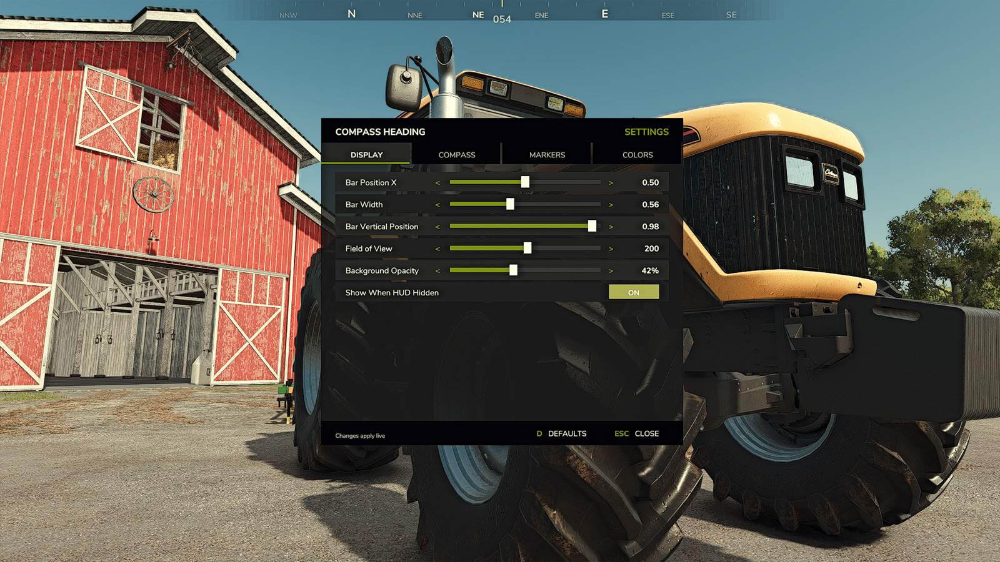
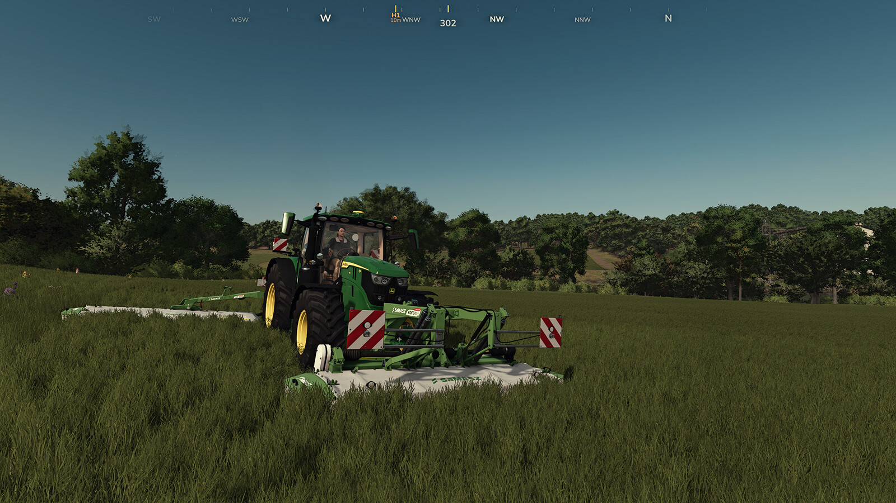
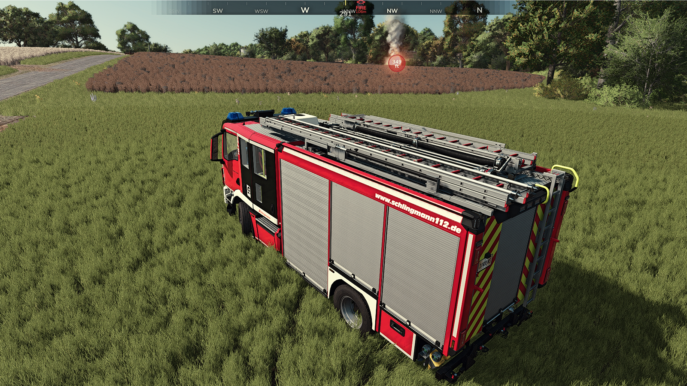
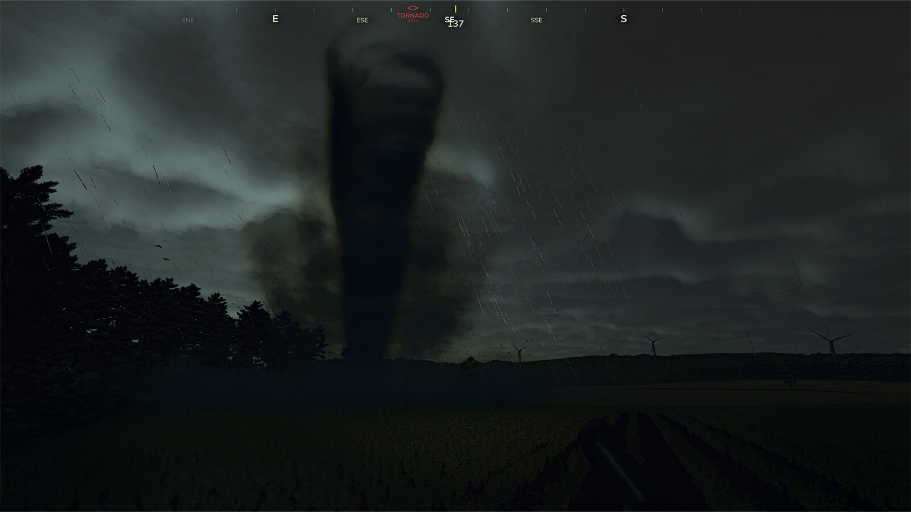
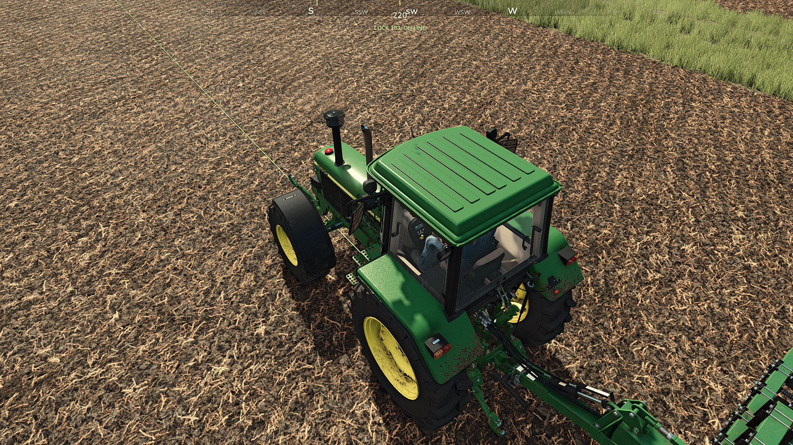
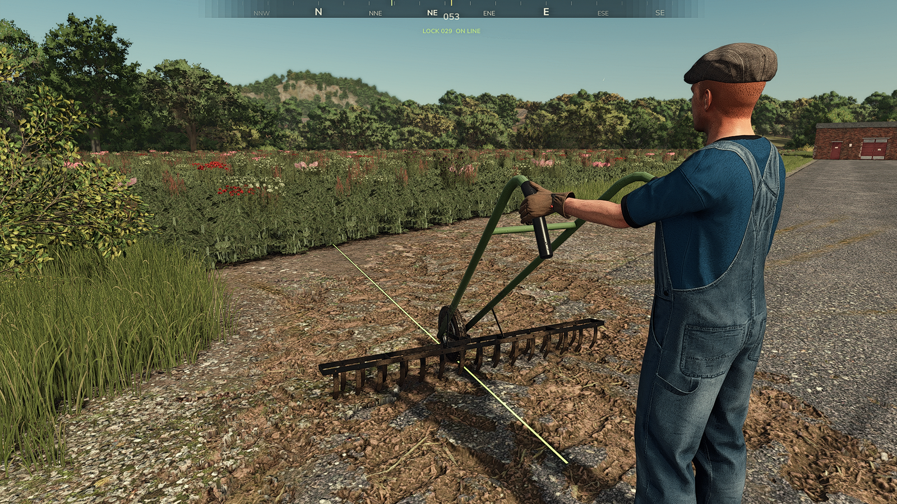
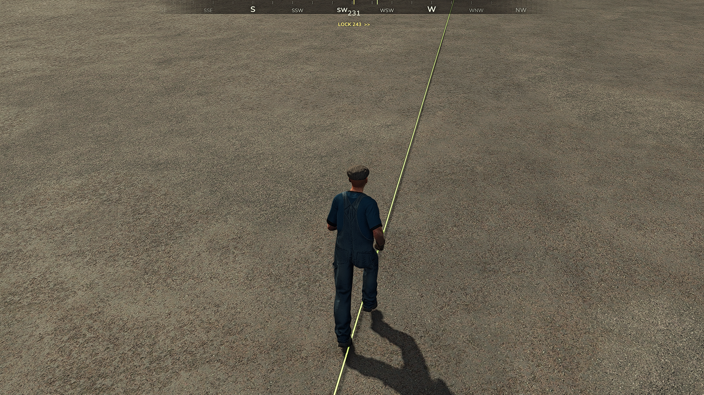

# Compass Heading Display — Official Wiki

**Mod:** FS25_CompassHeading
**Version:** 1.1.1.0
**Author:** RocklandUSA Gaming
**Platform:** Farming Simulator 25 (PC)
**Published at:** [rocklandgames.tv/mods/compass-heading-display](https://rocklandgames.tv/mods/compass-heading-display)

---

## Table of Contents

1. [Overview](#section-1--overview)
2. [Features](#section-2--features)
3. [Requirements](#section-3--requirements)
4. [Installation](#section-4--installation)
5. [Configuration](#section-5--configuration)
6. [API Reference](#section-6--api-reference)
7. [Events](#section-7--events)
8. [Integration Examples](#section-8--integration-examples)
9. [FAQ](#section-9--faq)
10. [Changelog](#section-10--changelog)
11. [Credits & License](#section-11--credits--license)

---

## Section 1 — Overview

### What It Does

Compass Heading Display adds a smooth, scrolling horizontal compass bar to the top of your screen in Farming Simulator 25. It provides constant situational awareness of your heading, nearby players, AI helpers, waypoints, and severe weather — all rendered directly on the game's HUD without any popup windows or menus.

**New in 1.1:** an in-game settings menu (default **F6**), a heading lock (default the **[** key) with an optional Steering / Walk Lock that holds your line, Wild Boar alerts for the GIANTS Vredo Pack DLC, and an Emergency Pack dispatch marker for the official GIANTS DLC.

Beyond the player-facing compass, Compass Heading Display also offers an **open compass API for the FS25 modding community**. Any mod can display custom markers on the compass bar with a few lines of Lua and zero hard dependencies. The public API includes 60 functions for markers, categories, animations, events, distance filtering, and navigation utilities.

### Why It Was Created

Farming Simulator 25 has no native compass or directional HUD. Players navigating large maps, coordinating in multiplayer, or managing AI helpers have to rely on the minimap or guess directions. Compass Heading Display solves this by providing an always-visible, non-intrusive heading reference that works on foot, in vehicles, and across all camera modes.

The public API was designed so that other mod developers — building delivery systems, emergency mods, navigation tools, or rural-life-sim frameworks — can place their own markers on the compass without writing any rendering code.

### Who It's For

| Audience | Benefit |
|----------|---------|
| **Players** | Always-visible compass heading, player tracking, helper alerts |
| **Server Admins** | Works on dedicated servers, farm-based marker filtering |
| **Mod Developers** | 60-function public API for custom marker integration |

### Screenshots

| Screenshot | Description |
|------------|-------------|
|  | In-game settings menu (default F6), DISPLAY tab — live sliders, Show When HUD Hidden toggle, and DEFAULTS / CLOSE footer buttons |
|  | Compass bar while mowing a grass field with a tractor, heading 302 (WNW) |
|  | Emergency Pack DLC dispatch marker — a flashing emergency marker on the compass points to the active call |
|  | Third-party PICKUP marker at 6m on the compass at a house porch at night, heading 080 (E) |
|  | Flashing red TORNADO marker at 97m during severe weather |
|  | Compass bar while driving a tractor and cultivator across a tilled field |
|  | Heading lock on foot with a hand tool — a thin lime guidance line runs along the ground ahead |
|  | Walk lock active — the occluded, terrain-following lime bearing line holds a perfectly straight row |
|  | On-foot scene beside a ladder truck at a fire station, heading 050 (NE) |

### Compatibility

| Environment | Supported |
|-------------|-----------|
| Farming Simulator 25 (PC) | Yes |
| Singleplayer | Yes |
| Multiplayer (client) | Yes |
| Multiplayer (dedicated server) | Yes — renders on clients only |
| Console (PlayStation/Xbox) | No — console mods cannot include Lua |
| FS22 or earlier | No |

---

## Section 2 — Features

### Complete Feature List

| Feature | Description |
|---------|-------------|
| **16-Point Compass Rose** | Full N/NNE/NE/ENE/E/ESE/SE/SSE/S/SSW/SW/WSW/W/WNW/NW/NNW labels with smooth scrolling |
| **In-Game Settings Menu (F6)** | Configure the compass in-game across four tabs — Display, Compass, Markers, Colours — with a DEFAULTS reset; all changes still persist to settings.xml (new in 1.1) |
| **Heading Lock** | Pin your current bearing (default `[` key) with a live steer-correction cue and an on-line indicator for dead-straight passes (new in 1.1) |
| **Steering / Walk Lock** | Optional hold that keeps your line automatically — vehicles drive straight and on foot you stay on the bearing, with a thin ground guidance line running ahead (new in 1.1) |
| **Wild Boar Alerts** | Flashing marker points to a wild boar herd that wanders onto land your own farm owns, so you can clear it before it damages the field — your own fields only, if you own the GIANTS Vredo Pack DLC (new in 1.1) |
| **Emergency Pack Dispatch Marker** | Flashing marker points to your active dispatch if you own the official GIANTS Emergency Pack DLC (new in 1.1) |
| **Rebindable Keybinds** | The F6 settings key and `[` heading-lock key are reassignable in Options → Controls (new in 1.1) |
| **Numeric Heading** | Live 000°–359° heading displayed below the compass bar |
| **Tick Marks** | Subtle tick marks every 10° for precise heading reference |
| **Gold Center Indicator** | Fixed gold tick at screen center showing your exact look direction |
| **Waypoint Tracking** | Detects the FS25 navigation target and displays an orange marker with distance |
| **Player Markers** | Shows other players on the compass with their name and distance, colored by farm |
| **Farm Filtering** | Filter player/helper markers to show only your farm or all farms |
| **Helper Markers** | AI worker markers (H1, H2, etc.) with farm coloring |
| **Blocked Helper Alerts** | Stuck helpers flash red with an exclamation mark and elevated priority |
| **Tornado Tracking** | Scans the scene for tornado objects and shows a flashing red diamond with distance |
| **Teleport Detection** | Suppresses marker jitter for 0.5 seconds after a player teleports |
| **Auto-Hide** | Automatically hides when GUI screens, menus, or the ESC screen are open |
| **Camera-Aware Heading** | Compass always shows where you are looking — works with free-look, 3rd person orbit, and interior camera |
| **Farm Coloring** | Player and helper markers use the farm's assigned color (brightened for visibility) |
| **Marker Clamping** | Off-screen markers clamp to bar edges with `<` / `>` indicators |
| **Distance Display** | Markers show distance in meters (< 1km) or kilometers (>= 1km) |
| **Settings Persistence** | All settings saved to XML and restored on next load |
| **Full Public API** | 60 functions for third-party mod integration |
| **Provider Registry** | Mods register as marker providers — zero-dependency integration |
| **Standalone Markers** | Add/remove/update individual markers by ID with animations |
| **Marker Animations** | Flash, pulse, fade-in, and urgent effects on any marker |
| **Category System** | Group markers into categories with per-category enable/disable and coloring |
| **Event System** | Subscribe to marker enter/exit view, add/remove, compass toggle, and settings change events |
| **Distance Filtering** | Markers can define min/max display distance |
| **TTL Markers** | Auto-expiring markers with configurable time-to-live |
| **Configurable Layout** | Bar position, width, vertical position, field of view, and opacity all adjustable |
| **Configurable Colors** | Every color is individually customizable via settings.xml or API |

### What Makes It Unique

Unlike other compass mods that only display a heading number or a basic bar, Compass Heading Display is a **full marker platform**:

- **Other compass mods:** Show a heading number. Period.
- **Compass Heading Display:** Shows heading, cardinal labels, players, helpers, waypoints, tornados, custom mod markers, has a 60-function API, event system, animation engine, category management, distance filtering, and provider registry.

No other FS25 compass mod exposes a public API. Compass Heading Display is designed from the ground up as infrastructure that the entire modding community can build on.

---

## Section 3 — Requirements

### Minimum Requirements

| Requirement | Detail |
|-------------|--------|
| **Game** | Farming Simulator 25, version 1.16 or newer |
| **Platform** | PC (Windows or Linux dedicated server) |
| **Dependencies** | None — fully standalone, zero dependencies |

### Multiplayer Compatibility

Compass Heading Display is fully multiplayer-compatible:

- Each client renders its own compass independently
- Player positions are read from the game's player system — no custom network events
- Helper and vehicle data is read from the shared vehicle system
- No server-side processing required

### Dedicated Server Compatibility

On a dedicated server (headless, no GPU):

- The mod loads without errors
- Overlay creation is silently skipped (no GPU available)
- No rendering occurs — the mod has zero server-side impact
- Clients connecting to the server render their own compass locally

### Mod Conflicts

Compass Heading Display has no known conflicts with any other mod. It does not modify any vanilla game systems, intercept any input, or alter any game data. It only reads existing game state (player positions, vehicle positions, camera direction) and renders its own HUD overlay.

---

## Section 4 — Installation

### Single Player

1. Download `FS25_CompassHeading.zip` from ModHub
2. Place the zip file in your mods folder:
   ```
   Documents/My Games/FarmingSimulator2025/mods/FS25_CompassHeading.zip
   ```
3. Launch Farming Simulator 25
4. Enable "Compass Heading Display" in the mod manager
5. Start or load a save game — the compass appears at the top of the screen

### Multiplayer Client

1. Download `FS25_CompassHeading.zip` from ModHub
2. Place the zip file in your mods folder:
   ```
   Documents/My Games/FarmingSimulator2025/mods/FS25_CompassHeading.zip
   ```
3. The mod will be listed in the server's mod selection
4. If the server has the mod installed, it will sync automatically
5. The compass renders locally on your client

### Dedicated Server

1. Upload `FS25_CompassHeading.zip` to the server's mods directory:
   ```
   /profile/mods/FS25_CompassHeading.zip
   ```
2. Add the mod to the server's active mod list
3. Restart the server
4. Clients connecting will see the compass on their screens

### File Structure After Installation

```
FS25_CompassHeading.zip
├── modDesc.xml              # Mod descriptor (version, descriptions, l10n)
├── CompassHeading.lua       # All mod logic in a single file
├── icon_compassheading.dds  # 512x512 mod icon (BC1_UNORM)
├── brand_rocklandusagaming.dds  # Brand icon
├── white.dds                # 1x1 white pixel for overlay rendering
├── l10n_en.xml              # English localization
├── l10n_de.xml              # German localization
└── l10n_fr.xml              # French localization
```

---

## Section 5 — Configuration

### Settings File Location

Settings are stored in an XML file at:

```
Documents/My Games/FarmingSimulator2025/modSettings/FS25_CompassHeading/settings.xml
```

This file is created automatically on first load with default values. Edit it with any text editor while the game is not running, or use the API to change settings at runtime.

### All Settings

#### Display Settings

| Setting | Type | Default | Description |
|---------|------|---------|-------------|
| `enabled` | boolean | `true` | Master enable/disable for the entire compass |
| `barPositionX` | float | `0.500` | Horizontal center position (0.0 = left edge, 1.0 = right edge) |
| `barWidth` | float | `0.680` | Width of the compass bar (fraction of screen width) |
| `barVerticalY` | float | `0.974` | Vertical center position (0.0 = bottom, 1.0 = top) |
| `fieldOfView` | float | `160` | Degrees of compass visible on the bar (30–360) |
| `backgroundOpacity` | float | `0.62` | Background bar opacity (0.0 = invisible, 1.0 = solid black) |

#### Compass Element Visibility

| Setting | Type | Default | Description |
|---------|------|---------|-------------|
| `showCardinalLabels` | boolean | `true` | Show N/S/E/W labels |
| `showIntercardinalLabels` | boolean | `true` | Show NE/SE/SW/NW labels |
| `showMinorLabels` | boolean | `true` | Show NNE/ENE/ESE/etc. labels |
| `showTickMarks` | boolean | `true` | Show 10° tick marks |
| `showCenterIndicator` | boolean | `true` | Show gold center tick |
| `showDegreeReadout` | boolean | `true` | Show numeric heading below bar |

#### Marker Visibility

| Setting | Type | Default | Description |
|---------|------|---------|-------------|
| `showPlayerMarkers` | boolean | `true` | Show other player markers |
| `playerMarkerFilter` | string | `"all"` | `"all"` = all players, `"farm"` = same farm only |
| `showWaypointMarker` | boolean | `true` | Show navigation waypoint marker |
| `showTornadoMarker` | boolean | `true` | Show tornado detection marker |
| `showHelperMarkers` | boolean | `true` | Show AI helper markers |
| `helperMarkerFilter` | string | `"all"` | `"all"` = all farms, `"farm"` = same farm only |

#### Color Settings

All colors are specified as RGBA values (0.0–1.0). In the settings.xml file, each color has `r`, `g`, `b`, and `a` attributes.

| Setting | Default RGBA | Description |
|---------|-------------|-------------|
| `colCenterIndicator` | 1.00, 0.85, 0.15, 1.00 | Gold center tick color |
| `colDegreeReadout` | 1.00, 1.00, 1.00, 0.50 | Heading number color |
| `colCardinal` | 1.00, 1.00, 1.00, 1.00 | N/S/E/W label color |
| `colIntercardinal` | 0.88, 0.88, 0.88, 1.00 | NE/SE/SW/NW label color |
| `colMinor` | 0.65, 0.65, 0.65, 1.00 | NNE/ENE/etc. label color |
| `colPlayerMarker` | 0.25, 0.88, 1.00, 1.00 | Default player marker color (cyan) |
| `colWaypointMarker` | 1.00, 0.55, 0.05, 1.00 | Waypoint marker color (orange) |
| `colTornadoMarker` | 1.00, 0.15, 0.15, 1.00 | Tornado marker color (red) |
| `colHelperMarker` | 0.60, 0.90, 0.40, 1.00 | Helper marker color (green) |
| `colHelperBlocked` | 1.00, 0.25, 0.25, 1.00 | Blocked helper color (red) |

### Example settings.xml

```xml
<?xml version="1.0" encoding="utf-8" standalone="no"?>
<CompassHeading>
    <enabled>true</enabled>
    <display barPositionX="0.5" barWidth="0.68" barVerticalY="0.974"
             fieldOfView="160" backgroundOpacity="0.62"/>
    <compass showCardinalLabels="true" showIntercardinalLabels="true"
             showMinorLabels="true" showTickMarks="true"
             showCenterIndicator="true" showDegreeReadout="true"/>
    <markers showPlayerMarkers="true" playerMarkerFilter="all"
             showWaypointMarker="true" showTornadoMarker="true"
             showHelperMarkers="true" helperMarkerFilter="all"/>
    <colors>
        <centerIndicator r="1.00" g="0.85" b="0.15" a="1.00"/>
        <playerMarker r="0.25" g="0.88" b="1.00" a="1.00"/>
        <!-- ... additional color entries ... -->
    </colors>
</CompassHeading>
```

---

## Section 6 — API Reference

The public API is published at two locations after map load:

```lua
local API = g_currentMission.compassHeading    -- Recommended access path
local API = g_compassHeading                    -- Global fallback (internal)
```

All API functions follow the pattern `g_currentMission.compassHeading.functionName()`.

> **Important:** Always check `API.isReady()` before calling other functions. The API is not available until `loadMap` has completed.

---

### Category: System Status

---

### API: isReady()

**Description:** Checks whether the Compass Heading Display system is loaded and ready to accept API calls.

**Parameters:** None

**Returns:** `boolean` — `true` if the compass system is initialized and the API is available, `false` otherwise.

**Example:**
```lua
local API = g_currentMission.compassHeading
if API and API.isReady() then
    print("Compass Heading Display is ready")
end
```

**Notes:** Always call this before using any other API function. Returns `false` on dedicated servers where no rendering occurs, and during the brief window before `loadMap` completes.

**Related APIs:** `getVersion()`

---

### API: getVersion()

**Description:** Returns the current version string of the Compass Heading Display mod.

**Parameters:** None

**Returns:** `string` — Version string in `"major.minor.patch.build"` format (e.g., `"1.1.0.0"`).

**Example:**
```lua
local API = g_currentMission.compassHeading
if API then
    print("Compass version: " .. API.getVersion())
end
```

**Notes:** Useful for checking compatibility if your mod requires a specific minimum version.

**Related APIs:** `isReady()`

---

### Category: Enable / Disable

---

### API: setEnabled(enabled)

**Description:** Enables or disables the entire compass HUD. When disabled, nothing is rendered and no marker processing occurs.

**Parameters:**

| Name | Type | Required | Description |
|------|------|----------|-------------|
| `enabled` | boolean | Yes | `true` to show the compass, `false` to hide it |

**Returns:** None

**Example:**
```lua
local API = g_currentMission.compassHeading

-- Hide the compass
API.setEnabled(false)

-- Show the compass
API.setEnabled(true)
```

**Notes:** Fires the `compassToggle` event when the state changes. The setting persists only for the current session — use `saveSettings()` to persist across sessions.

**Related APIs:** `isEnabled()`, `onCompassToggle()`

---

### API: isEnabled()

**Description:** Returns whether the compass is currently enabled.

**Parameters:** None

**Returns:** `boolean` — `true` if the compass is enabled and rendering, `false` if disabled.

**Example:**
```lua
local API = g_currentMission.compassHeading
if API.isEnabled() then
    print("Compass is visible")
end
```

**Related APIs:** `setEnabled()`

---

### Category: Settings

---

### API: getSetting(key)

**Description:** Retrieves the current value of a single setting by its key name.

**Parameters:**

| Name | Type | Required | Description |
|------|------|----------|-------------|
| `key` | string | Yes | The setting key (e.g., `"fieldOfView"`, `"showPlayerMarkers"`) |

**Returns:** The setting value (type varies: `boolean`, `number`, `string`, or `table` for colors). Returns `nil` if the key is invalid.

**Example:**
```lua
local API = g_currentMission.compassHeading
local fov = API.getSetting("fieldOfView")
print("Current FOV: " .. tostring(fov))

local playerColor = API.getSetting("colPlayerMarker")
-- playerColor = {r=0.25, g=0.88, b=1.00, a=1.00}
```

**Notes:** Color values are returned as a copy — modifying the returned table does not affect the setting. Use `setSetting()` to write changes.

**Related APIs:** `setSetting()`, `getSettings()`

---

### API: setSetting(key, value)

**Description:** Updates a single setting by its key name.

**Parameters:**

| Name | Type | Required | Description |
|------|------|----------|-------------|
| `key` | string | Yes | The setting key to update |
| `value` | any | Yes | The new value (must match the expected type for the key) |

**Returns:** `boolean` — `true` if the setting was updated, `false` if the key is invalid or does not exist.

**Example:**
```lua
local API = g_currentMission.compassHeading

-- Change the compass field of view
API.setSetting("fieldOfView", 120)

-- Change background opacity
API.setSetting("backgroundOpacity", 0.8)

-- Change a color
API.setSetting("colPlayerMarker", {r=1, g=0.5, b=0, a=1})
```

**Notes:** Layout-related settings (`barPositionX`, `barWidth`, `barVerticalY`, `fieldOfView`) automatically trigger a layout recomputation. Fires the `settingChanged` event when the value changes. Call `saveSettings()` to persist the change to disk.

**Related APIs:** `getSetting()`, `saveSettings()`, `onSettingChanged()`

---

### API: getSettings()

**Description:** Returns a shallow copy of all current settings as a key-value table.

**Parameters:** None

**Returns:** `table` — A table containing all settings. Color values are copies (safe to modify).

**Example:**
```lua
local API = g_currentMission.compassHeading
local settings = API.getSettings()
for key, value in pairs(settings) do
    print(key .. " = " .. tostring(value))
end
```

**Notes:** The returned table is a snapshot — modifying it does not affect the live settings. Use `setSetting()` to apply changes.

**Related APIs:** `getSetting()`, `setSetting()`

---

### API: setFOV(degrees)

**Description:** Sets the compass field of view — how many degrees of the compass are visible on the bar at once.

**Parameters:**

| Name | Type | Required | Description |
|------|------|----------|-------------|
| `degrees` | number | Yes | Field of view in degrees (30–360) |

**Returns:** `boolean` — `true` if set successfully, `false` if the value is out of range or not a number.

**Example:**
```lua
local API = g_currentMission.compassHeading

-- Narrow FOV for precise navigation
API.setFOV(90)

-- Wide FOV to see more of the compass at once
API.setFOV(200)
```

**Notes:** Lower FOV values make the compass appear more zoomed-in (larger spacing between labels). Higher values show more of the compass but compress the spacing. Default is 160.

**Related APIs:** `getFOV()`

---

### API: getFOV()

**Description:** Returns the current compass field of view in degrees.

**Parameters:** None

**Returns:** `number` — Current FOV in degrees.

**Example:**
```lua
local API = g_currentMission.compassHeading
print("FOV: " .. API.getFOV() .. "°")
```

**Related APIs:** `setFOV()`

---

### API: setBarPosition(x, y)

**Description:** Sets the horizontal and/or vertical center position of the compass bar on screen.

**Parameters:**

| Name | Type | Required | Description |
|------|------|----------|-------------|
| `x` | number | No | Horizontal center (0.0 = left, 1.0 = right). Pass `nil` to leave unchanged. |
| `y` | number | No | Vertical center (0.0 = bottom, 1.0 = top). Pass `nil` to leave unchanged. |

**Returns:** None

**Example:**
```lua
local API = g_currentMission.compassHeading

-- Move compass to bottom-center of screen
API.setBarPosition(0.5, 0.05)

-- Move compass to top-left
API.setBarPosition(0.35, 0.97)
```

**Notes:** Triggers layout recomputation immediately. Changes are visual only — call `saveSettings()` to persist.

**Related APIs:** `setBarWidth()`, `setSetting()`

---

### API: setBarWidth(w)

**Description:** Sets the width of the compass bar as a fraction of screen width.

**Parameters:**

| Name | Type | Required | Description |
|------|------|----------|-------------|
| `w` | number | Yes | Bar width (0.0–1.0). Default is 0.680. |

**Returns:** None

**Example:**
```lua
local API = g_currentMission.compassHeading

-- Full-width compass
API.setBarWidth(1.0)

-- Compact compass
API.setBarWidth(0.4)
```

**Related APIs:** `setBarPosition()`

---

### API: setBackgroundOpacity(a)

**Description:** Sets the opacity of the compass background bar.

**Parameters:**

| Name | Type | Required | Description |
|------|------|----------|-------------|
| `a` | number | Yes | Opacity (0.0 = fully transparent, 1.0 = fully opaque). Default is 0.62. |

**Returns:** None

**Example:**
```lua
local API = g_currentMission.compassHeading

-- Subtle background
API.setBackgroundOpacity(0.3)

-- Solid background
API.setBackgroundOpacity(1.0)
```

**Related APIs:** `setSetting()`

---

### API: reloadSettings()

**Description:** Reloads all settings from the settings.xml file on disk, discarding any runtime changes.

**Parameters:** None

**Returns:** None

**Example:**
```lua
local API = g_currentMission.compassHeading
API.reloadSettings()
print("Settings reloaded from disk")
```

**Notes:** This re-reads the XML file and recomputes the layout. Useful if the user edits settings.xml externally and wants to apply changes without restarting.

**Related APIs:** `saveSettings()`

---

### API: saveSettings()

**Description:** Writes all current settings to the settings.xml file on disk.

**Parameters:** None

**Returns:** None

**Example:**
```lua
local API = g_currentMission.compassHeading

-- Change a setting and persist it
API.setSetting("fieldOfView", 120)
API.saveSettings()
```

**Notes:** Settings are automatically saved when the game is closed normally. Use this for immediate persistence after API-driven changes.

**Related APIs:** `reloadSettings()`

---

### Category: Standalone Marker Lifecycle

---

### API: addMarker(id, opts)

**Description:** Adds a standalone marker to the compass at a fixed world position. The marker persists until explicitly removed or until its TTL expires.

**Parameters:**

| Name | Type | Required | Description |
|------|------|----------|-------------|
| `id` | string | Yes | Unique identifier for this marker |
| `opts` | table | Yes | Marker configuration table (see below) |

**Marker options table:**

| Field | Type | Required | Default | Description |
|-------|------|----------|---------|-------------|
| `x` | number | Yes | — | World X coordinate |
| `z` | number | Yes | — | World Z coordinate |
| `label` | string | No | `nil` | Text label displayed above the marker (max 12 chars) |
| `color` | table | No | Category color | `{r, g, b, a}` color table (0.0–1.0 each) |
| `style` | string | No | `"tick"` | Marker glyph style (see `getMarkerStyles()`) |
| `scale` | number | No | `1.0` | Size multiplier for the marker glyph |
| `priority` | number | No | `0` | Render priority (higher = drawn on top) |
| `category` | string | No | `"default"` | Category name for grouping and filtering |
| `maxDistance` | number | No | `0` | Maximum display distance in meters (0 = unlimited) |
| `minDistance` | number | No | `0` | Minimum display distance in meters (0 = no minimum) |
| `flash` | boolean | No | `false` | Enable flashing animation |
| `flashHz` | number | No | `2.0` | Flash frequency in Hz |
| `pulse` | boolean | No | `false` | Enable pulsing alpha animation |
| `pulseHz` | number | No | `1.0` | Pulse frequency in Hz |
| `pulseMin` | number | No | `0.3` | Minimum pulse alpha |
| `pulseMax` | number | No | `1.0` | Maximum pulse alpha |
| `fadeIn` | boolean | No | `false` | Enable fade-in on creation |
| `fadeInDur` | number | No | `0.5` | Fade-in duration in seconds |
| `urgent` | boolean | No | `false` | Enable urgent mode (flash + red shift) |
| `ttl` | number | No | `0` | Time-to-live in seconds (0 = permanent) |

**Returns:** `boolean` — `true` if the marker was added successfully, `false` on invalid input.

**Example:**
```lua
local API = g_currentMission.compassHeading

-- Simple marker at a world position
API.addMarker("my_shop", {
    x = 500, z = -300,
    label = "Shop",
    color = {r=1, g=0.9, b=0.3, a=1},
    style = "diamond",
    category = "shop"
})

-- Emergency marker with flashing and auto-expiry
API.addMarker("fire_01", {
    x = 1200, z = -800,
    label = "FIRE",
    color = {r=1, g=0.2, b=0.1, a=1},
    style = "exclaim",
    category = "emergency",
    urgent = true,
    ttl = 300,
    maxDistance = 5000
})
```

**Notes:** If a marker with the same `id` already exists, it is overwritten. Fires the `markerAdded` event.

**Related APIs:** `removeMarker()`, `updateMarker()`, `addTemporaryMarker()`, `hasMarker()`

---

### API: addTemporaryMarker(id, opts)

**Description:** Convenience wrapper for `addMarker()` that sets a default TTL of 10 seconds. Ideal for transient notifications.

**Parameters:**

| Name | Type | Required | Description |
|------|------|----------|-------------|
| `id` | string | Yes | Unique identifier for this marker |
| `opts` | table | Yes | Same options as `addMarker()`. If `ttl` is not specified, defaults to 10 seconds. |

**Returns:** `boolean` — `true` if the marker was added, `false` on error.

**Example:**
```lua
local API = g_currentMission.compassHeading

-- Flash a delivery point for 15 seconds
API.addTemporaryMarker("delivery_alert", {
    x = 800, z = -400,
    label = "Deliver",
    color = {r=1, g=0.75, b=0, a=1},
    style = "triangle",
    category = "delivery",
    ttl = 15,
    fadeIn = true
})
```

**Notes:** The marker auto-removes when TTL expires, firing the `markerExpired` event.

**Related APIs:** `addMarker()`

---

### API: removeMarker(id)

**Description:** Removes a standalone marker by its ID.

**Parameters:**

| Name | Type | Required | Description |
|------|------|----------|-------------|
| `id` | string | Yes | The marker ID to remove |

**Returns:** `boolean` — `true` if the marker was found and removed, `false` if no marker with that ID exists.

**Example:**
```lua
local API = g_currentMission.compassHeading
API.removeMarker("fire_01")
```

**Notes:** Fires the `markerRemoved` event on successful removal.

**Related APIs:** `addMarker()`, `clearMarkers()`

---

### API: updateMarker(id, fields)

**Description:** Updates one or more properties of an existing standalone marker without removing and re-adding it.

**Parameters:**

| Name | Type | Required | Description |
|------|------|----------|-------------|
| `id` | string | Yes | The marker ID to update |
| `fields` | table | Yes | Table of field names and new values to apply |

**Updatable fields:** `x`, `z`, `label`, `color`, `style`, `scale`, `priority`, `category`, `maxDistance`, `minDistance`, `flash`, `flashHz`, `pulse`, `pulseMin`, `pulseMax`, `pulseHz`, `urgent`, `ttl`, `fadeIn`, `fadeInDur`

**Returns:** `boolean` — `true` if the marker was found and updated, `false` if the marker does not exist.

**Example:**
```lua
local API = g_currentMission.compassHeading

-- Move a marker to a new position
API.updateMarker("fire_01", {x = 1250, z = -820})

-- Change color and enable flashing
API.updateMarker("fire_01", {
    color = {r=1, g=0, b=0, a=1},
    flash = true,
    flashHz = 4.0
})
```

**Notes:** Only specified fields are changed — unspecified fields retain their current values. Color values are deep-copied.

**Related APIs:** `addMarker()`, `getMarker()`, `setMarkerPosition()`, `setMarkerColor()`, `setMarkerLabel()`, `setMarkerStyle()`

---

### API: getMarker(id)

**Description:** Returns a copy of a standalone marker's public properties.

**Parameters:**

| Name | Type | Required | Description |
|------|------|----------|-------------|
| `id` | string | Yes | The marker ID to retrieve |

**Returns:** `table|nil` — A copy of the marker's properties (excluding internal `_`-prefixed fields), or `nil` if no marker with that ID exists.

**Example:**
```lua
local API = g_currentMission.compassHeading
local marker = API.getMarker("my_shop")
if marker then
    print("Shop is at: " .. marker.x .. ", " .. marker.z)
    print("Category: " .. marker.category)
end
```

**Notes:** The returned table is a copy — modifying it does not affect the actual marker. Use `updateMarker()` to make changes.

**Related APIs:** `hasMarker()`, `updateMarker()`

---

### API: hasMarker(id)

**Description:** Checks whether a standalone marker with the given ID exists.

**Parameters:**

| Name | Type | Required | Description |
|------|------|----------|-------------|
| `id` | string | Yes | The marker ID to check |

**Returns:** `boolean` — `true` if the marker exists, `false` otherwise.

**Example:**
```lua
local API = g_currentMission.compassHeading
if not API.hasMarker("my_shop") then
    API.addMarker("my_shop", {x=500, z=-300, label="Shop"})
end
```

**Related APIs:** `getMarker()`, `addMarker()`

---

### API: clearMarkers(category)

**Description:** Removes all standalone markers, optionally filtered by category.

**Parameters:**

| Name | Type | Required | Description |
|------|------|----------|-------------|
| `category` | string | No | If provided, only markers in this category are removed. If `nil`, all markers are removed. |

**Returns:** `number` — The number of markers removed.

**Example:**
```lua
local API = g_currentMission.compassHeading

-- Remove all emergency markers
local count = API.clearMarkers("emergency")
print("Removed " .. count .. " emergency markers")

-- Remove ALL standalone markers
API.clearMarkers()
```

**Notes:** Fires the `markerRemoved` event for each removed marker. Does not affect built-in markers (players, helpers, waypoints, tornado) or provider markers.

**Related APIs:** `removeMarker()`, `getMarkerCount()`

---

### API: getMarkerCount(category)

**Description:** Returns the number of active standalone markers.

**Parameters:**

| Name | Type | Required | Description |
|------|------|----------|-------------|
| `category` | string | No | If provided, counts only markers in this category. If `nil`, counts all markers. |

**Returns:** `number` — The count of matching markers.

**Example:**
```lua
local API = g_currentMission.compassHeading
local total = API.getMarkerCount()
local emergencies = API.getMarkerCount("emergency")
print(total .. " total markers, " .. emergencies .. " emergency")
```

**Related APIs:** `clearMarkers()`, `hasMarker()`

---

### Category: Provider Management

---

### API: getProvider(id)

**Description:** Returns the provider object registered with the given ID.

**Parameters:**

| Name | Type | Required | Description |
|------|------|----------|-------------|
| `id` | string | Yes | The provider ID to look up |

**Returns:** `table|nil` — The provider object, or `nil` if no provider with that ID is registered.

**Example:**
```lua
local API = g_currentMission.compassHeading
local provider = API.getProvider("my_delivery_mod")
if provider then
    print("Provider active: " .. tostring(provider.enabled ~= false))
end
```

**Notes:** Returns the actual provider object (not a copy). Modifying it directly affects the provider.

**Related APIs:** `getProviders()`, `isProviderActive()`

---

### API: getProviders()

**Description:** Returns a list of all registered providers with summary information.

**Parameters:** None

**Returns:** `table` — Array of tables, each containing `{id, label, enabled, category}`.

**Example:**
```lua
local API = g_currentMission.compassHeading
local providers = API.getProviders()
for _, p in ipairs(providers) do
    print(string.format("Provider: %s [%s] enabled=%s",
        p.id, p.category, tostring(p.enabled)))
end
```

**Related APIs:** `getProvider()`, `setProviderEnabled()`

---

### API: isProviderActive(id)

**Description:** Checks if a provider is registered and enabled.

**Parameters:**

| Name | Type | Required | Description |
|------|------|----------|-------------|
| `id` | string | Yes | The provider ID |

**Returns:** `boolean` — `true` if the provider exists and is enabled, `false` otherwise.

**Example:**
```lua
local API = g_currentMission.compassHeading
if API.isProviderActive("firefighter_mod") then
    print("Fire mod markers are active on compass")
end
```

**Related APIs:** `setProviderEnabled()`, `getProvider()`

---

### API: setProviderEnabled(id, enabled)

**Description:** Enables or disables a registered provider without unregistering it.

**Parameters:**

| Name | Type | Required | Description |
|------|------|----------|-------------|
| `id` | string | Yes | The provider ID |
| `enabled` | boolean | Yes | `true` to enable, `false` to disable |

**Returns:** `boolean` — `true` if the provider was found and updated, `false` if no provider with that ID exists.

**Example:**
```lua
local API = g_currentMission.compassHeading

-- Temporarily disable a mod's markers
API.setProviderEnabled("delivery_mod", false)

-- Re-enable
API.setProviderEnabled("delivery_mod", true)
```

**Notes:** When disabled, the provider's `getPoints()` method is not called and its markers are not rendered.

**Related APIs:** `isProviderActive()`

---

### Category: Category Management

---

### API: setCategoryEnabled(category, enabled)

**Description:** Enables or disables an entire category of markers. When a category is disabled, no markers in that category are rendered — including built-in markers, standalone markers, and provider markers.

**Parameters:**

| Name | Type | Required | Description |
|------|------|----------|-------------|
| `category` | string | Yes | The category name |
| `enabled` | boolean | Yes | `true` to enable, `false` to disable |

**Returns:** `boolean` — `true` on success, `false` on invalid input.

**Example:**
```lua
local API = g_currentMission.compassHeading

-- Disable all helper markers
API.setCategoryEnabled("helper", false)

-- Disable all emergency markers (hides tornado + fire markers)
API.setCategoryEnabled("emergency", false)
```

**Notes:** The category is auto-created if it doesn't exist yet. Built-in marker categories include: `player`, `waypoint`, `emergency`, `helper`.

**Related APIs:** `isCategoryEnabled()`, `getCategories()`

---

### API: isCategoryEnabled(category)

**Description:** Checks whether a category is currently enabled.

**Parameters:**

| Name | Type | Required | Description |
|------|------|----------|-------------|
| `category` | string | Yes | The category name |

**Returns:** `boolean` — `true` if enabled (or if the category has never been explicitly set), `false` if disabled.

**Example:**
```lua
local API = g_currentMission.compassHeading
if API.isCategoryEnabled("emergency") then
    print("Emergency markers are visible")
end
```

**Related APIs:** `setCategoryEnabled()`

---

### API: setCategoryColor(category, color)

**Description:** Sets the default color for markers in a category. New markers that don't specify a custom color will inherit this color.

**Parameters:**

| Name | Type | Required | Description |
|------|------|----------|-------------|
| `category` | string | Yes | The category name |
| `color` | table | Yes | `{r, g, b, a}` color table (0.0–1.0 each) |

**Returns:** `boolean` — `true` on success, `false` on invalid input.

**Example:**
```lua
local API = g_currentMission.compassHeading
API.setCategoryColor("delivery", {r=1.0, g=0.8, b=0.0, a=1.0})
```

**Related APIs:** `getCategoryColor()`

---

### API: getCategoryColor(category)

**Description:** Returns the current default color for a category.

**Parameters:**

| Name | Type | Required | Description |
|------|------|----------|-------------|
| `category` | string | Yes | The category name |

**Returns:** `table` — `{r, g, b, a}` color table. Returns the built-in default if the category hasn't been customized.

**Example:**
```lua
local API = g_currentMission.compassHeading
local color = API.getCategoryColor("emergency")
print(string.format("Emergency color: R=%.2f G=%.2f B=%.2f",
    color.r, color.g, color.b))
```

**Related APIs:** `setCategoryColor()`, `getDefaultCategories()`

---

### API: getCategories()

**Description:** Returns a list of all active categories with their current state.

**Parameters:** None

**Returns:** `table` — Array of tables, each containing `{name, enabled, color}`.

**Example:**
```lua
local API = g_currentMission.compassHeading
local categories = API.getCategories()
for _, cat in ipairs(categories) do
    print(string.format("%s: enabled=%s, color=(%0.1f,%0.1f,%0.1f)",
        cat.name, tostring(cat.enabled), cat.color.r, cat.color.g, cat.color.b))
end
```

**Related APIs:** `getDefaultCategories()`

---

### Category: Event Callbacks

---

### API: on(event, callback)

**Description:** Registers a callback function for a named event. This is the generic event subscription function.

**Parameters:**

| Name | Type | Required | Description |
|------|------|----------|-------------|
| `event` | string | Yes | Event name (see [Events](#section-7--events) for full list) |
| `callback` | function | Yes | Function to call when the event fires |

**Returns:** `number|nil` — Callback index (for reference), or `nil` if the compass is not ready.

**Example:**
```lua
local API = g_currentMission.compassHeading
API.on("markerAdded", function(id)
    print("Marker added: " .. id)
end)
```

**Notes:** Callbacks are wrapped in `pcall` — a failing callback will not crash the compass or other callbacks. There is no `off()` / unsubscribe function; callbacks persist until `deleteMap`.

**Related APIs:** `onMarkerEnterView()`, `onMarkerExitView()`, `onCompassToggle()`, `onSettingChanged()`, `onMarkerAdded()`, `onMarkerRemoved()`, `onMarkerExpired()`, `onProviderRegistered()`, `onProviderUnregistered()`

---

### API: onMarkerEnterView(callback)

**Description:** Registers a callback that fires when a marker scrolls into the visible compass bar.

**Parameters:**

| Name | Type | Required | Description |
|------|------|----------|-------------|
| `callback` | function | Yes | `function(markerId)` — called with the marker's ID string |

**Returns:** `number|nil` — Callback index.

**Example:**
```lua
local API = g_currentMission.compassHeading
API.onMarkerEnterView(function(id)
    print("Now visible: " .. id)
end)
```

**Related APIs:** `onMarkerExitView()`, `on()`

---

### API: onMarkerExitView(callback)

**Description:** Registers a callback that fires when a marker scrolls out of the visible compass bar.

**Parameters:**

| Name | Type | Required | Description |
|------|------|----------|-------------|
| `callback` | function | Yes | `function(markerId)` — called with the marker's ID string |

**Returns:** `number|nil` — Callback index.

**Example:**
```lua
local API = g_currentMission.compassHeading
API.onMarkerExitView(function(id)
    print("No longer visible: " .. id)
end)
```

**Related APIs:** `onMarkerEnterView()`, `on()`

---

### API: onCompassToggle(callback)

**Description:** Registers a callback that fires when the compass is enabled or disabled via `setEnabled()`.

**Parameters:**

| Name | Type | Required | Description |
|------|------|----------|-------------|
| `callback` | function | Yes | `function(enabled)` — called with `true` when enabled, `false` when disabled |

**Returns:** `number|nil` — Callback index.

**Example:**
```lua
local API = g_currentMission.compassHeading
API.onCompassToggle(function(enabled)
    print("Compass is now " .. (enabled and "ON" or "OFF"))
end)
```

**Related APIs:** `setEnabled()`, `on()`

---

### API: onProviderRegistered(callback)

**Description:** Registers a callback that fires when a new marker provider is registered via the registry.

**Parameters:**

| Name | Type | Required | Description |
|------|------|----------|-------------|
| `callback` | function | Yes | `function(providerId)` — called with the provider's ID string |

**Returns:** `number|nil` — Callback index.

**Example:**
```lua
local API = g_currentMission.compassHeading
API.onProviderRegistered(function(id)
    print("New compass provider: " .. id)
end)
```

**Related APIs:** `onProviderUnregistered()`, `on()`

---

### API: onProviderUnregistered(callback)

**Description:** Registers a callback that fires when a marker provider is unregistered.

**Parameters:**

| Name | Type | Required | Description |
|------|------|----------|-------------|
| `callback` | function | Yes | `function(providerId)` — called with the provider's ID string |

**Returns:** `number|nil` — Callback index.

**Example:**
```lua
local API = g_currentMission.compassHeading
API.onProviderUnregistered(function(id)
    print("Provider removed: " .. id)
end)
```

**Related APIs:** `onProviderRegistered()`, `on()`

---

### API: onSettingChanged(callback)

**Description:** Registers a callback that fires when any setting is changed via `setSetting()`.

**Parameters:**

| Name | Type | Required | Description |
|------|------|----------|-------------|
| `callback` | function | Yes | `function(key, newValue, oldValue)` |

**Returns:** `number|nil` — Callback index.

**Example:**
```lua
local API = g_currentMission.compassHeading
API.onSettingChanged(function(key, newVal, oldVal)
    print(string.format("Setting '%s' changed: %s -> %s",
        key, tostring(oldVal), tostring(newVal)))
end)
```

**Related APIs:** `setSetting()`, `on()`

---

### API: onMarkerAdded(callback)

**Description:** Registers a callback that fires when a standalone marker is added.

**Parameters:**

| Name | Type | Required | Description |
|------|------|----------|-------------|
| `callback` | function | Yes | `function(markerId)` |

**Returns:** `number|nil` — Callback index.

**Example:**
```lua
local API = g_currentMission.compassHeading
API.onMarkerAdded(function(id)
    print("Marker created: " .. id)
end)
```

**Related APIs:** `addMarker()`, `onMarkerRemoved()`, `on()`

---

### API: onMarkerRemoved(callback)

**Description:** Registers a callback that fires when a standalone marker is removed (manually or via `clearMarkers()`).

**Parameters:**

| Name | Type | Required | Description |
|------|------|----------|-------------|
| `callback` | function | Yes | `function(markerId)` |

**Returns:** `number|nil` — Callback index.

**Example:**
```lua
local API = g_currentMission.compassHeading
API.onMarkerRemoved(function(id)
    print("Marker removed: " .. id)
end)
```

**Related APIs:** `removeMarker()`, `clearMarkers()`, `onMarkerAdded()`, `on()`

---

### API: onMarkerExpired(callback)

**Description:** Registers a callback that fires when a standalone marker's TTL expires and it is auto-removed.

**Parameters:**

| Name | Type | Required | Description |
|------|------|----------|-------------|
| `callback` | function | Yes | `function(markerId)` |

**Returns:** `number|nil` — Callback index.

**Example:**
```lua
local API = g_currentMission.compassHeading
API.onMarkerExpired(function(id)
    print("Marker expired: " .. id)
    -- Could re-add or trigger follow-up logic here
end)
```

**Related APIs:** `addTemporaryMarker()`, `on()`

---

### Category: Distance & Proximity

---

### API: getNearestMarker(category)

**Description:** Finds the nearest standalone marker to the player, optionally filtered by category.

**Parameters:**

| Name | Type | Required | Description |
|------|------|----------|-------------|
| `category` | string | No | If provided, only searches markers in this category |

**Returns:** `table|nil` — `{id, x, z, label, category, distance}` for the nearest marker, or `nil` if no markers exist.

**Example:**
```lua
local API = g_currentMission.compassHeading
local nearest = API.getNearestMarker("delivery")
if nearest then
    print(string.format("Nearest delivery: %s at %dm", nearest.label, nearest.distance))
end
```

**Related APIs:** `getMarkersInRange()`, `getDistanceTo()`

---

### API: getMarkersInRange(range, category)

**Description:** Returns all standalone markers within a specified distance from the player.

**Parameters:**

| Name | Type | Required | Description |
|------|------|----------|-------------|
| `range` | number | Yes | Maximum distance in meters |
| `category` | string | No | If provided, only returns markers in this category |

**Returns:** `table` — Array of `{id, x, z, label, category, distance}` tables for each marker in range.

**Example:**
```lua
local API = g_currentMission.compassHeading

-- Find all emergency markers within 2km
local nearby = API.getMarkersInRange(2000, "emergency")
for _, m in ipairs(nearby) do
    print(string.format("%s: %dm away", m.label, m.distance))
end
```

**Related APIs:** `getNearestMarker()`, `getDistanceTo()`

---

### Category: Navigation Utilities

---

### API: getBearing()

**Description:** Returns the player's current compass bearing (the heading displayed on the compass).

**Parameters:** None

**Returns:** `number|nil` — Heading in degrees (0–359.9), or `nil` if heading cannot be determined.

**Example:**
```lua
local API = g_currentMission.compassHeading
local bearing = API.getBearing()
if bearing then
    print(string.format("Heading: %03d°", math.floor(bearing + 0.5) % 360))
end
```

**Notes:** This is the same value displayed on the compass HUD. It reflects the camera's look direction (the direction the player is currently viewing on screen).

**Related APIs:** `getCardinalDirection()`, `getBearingTo()`

---

### API: getBearingTo(x, z)

**Description:** Calculates the compass bearing from the player's current position to a world coordinate.

**Parameters:**

| Name | Type | Required | Description |
|------|------|----------|-------------|
| `x` | number | Yes | Target world X coordinate |
| `z` | number | Yes | Target world Z coordinate |

**Returns:** `number|nil` — Bearing in degrees (0–359.9), or `nil` if player position is unavailable or target is within 2 meters.

**Example:**
```lua
local API = g_currentMission.compassHeading
local bearing = API.getBearingTo(1200, -800)
if bearing then
    print(string.format("Fire is at bearing %03d°", math.floor(bearing + 0.5)))
end
```

**Related APIs:** `getBearing()`, `getDistanceTo()`

---

### API: getDistanceTo(x, z)

**Description:** Calculates the straight-line distance from the player to a world coordinate.

**Parameters:**

| Name | Type | Required | Description |
|------|------|----------|-------------|
| `x` | number | Yes | Target world X coordinate |
| `z` | number | Yes | Target world Z coordinate |

**Returns:** `number|nil` — Distance in meters, or `nil` if player position is unavailable.

**Example:**
```lua
local API = g_currentMission.compassHeading
local dist = API.getDistanceTo(1200, -800)
if dist then
    print("Distance to target: " .. API.formatDistance(dist))
end
```

**Related APIs:** `getBearingTo()`, `formatDistance()`

---

### API: getPlayerPosition()

**Description:** Returns the player's current world position (X, Z coordinates).

**Parameters:** None

**Returns:** `number, number` — World X and Z coordinates, or `nil, nil` if unavailable.

**Example:**
```lua
local API = g_currentMission.compassHeading
local x, z = API.getPlayerPosition()
if x then
    print(string.format("Player at: (%.1f, %.1f)", x, z))
end
```

**Notes:** Position source priority: controlled vehicle rootNode > `g_localPlayer:getCurrentVehicle()` > player vehicle fields > active camera > player rootNode. This ensures correct position in all states (on foot, in vehicle, transitioning).

**Related APIs:** `getBearing()`, `getDistanceTo()`

---

### API: formatDistance(meters)

**Description:** Formats a distance value as a human-readable string, using meters for distances under 1km and kilometers for distances over 1km.

**Parameters:**

| Name | Type | Required | Description |
|------|------|----------|-------------|
| `meters` | number | Yes | Distance in meters |

**Returns:** `string` — Formatted distance (e.g., `"450m"`, `"2.3km"`).

**Example:**
```lua
local API = g_currentMission.compassHeading
print(API.formatDistance(450))    -- "450m"
print(API.formatDistance(2345))   -- "2.3km"
print(API.formatDistance(50))     -- "50m"
```

**Related APIs:** `getDistanceTo()`

---

### API: getCardinalDirection(bearing)

**Description:** Converts a numeric bearing to a 16-point cardinal direction string.

**Parameters:**

| Name | Type | Required | Description |
|------|------|----------|-------------|
| `bearing` | number | No | Bearing in degrees (0–360). If `nil`, uses the player's current heading. |

**Returns:** `string|nil` — Cardinal direction string (e.g., `"N"`, `"NNE"`, `"NE"`, `"ENE"`, etc.), or `nil` if bearing is unavailable.

**Example:**
```lua
local API = g_currentMission.compassHeading

-- Get current cardinal direction
local dir = API.getCardinalDirection()
print("Facing: " .. tostring(dir))  -- "NNW"

-- Convert a specific bearing
print(API.getCardinalDirection(45))   -- "NE"
print(API.getCardinalDirection(270))  -- "W"
print(API.getCardinalDirection(337))  -- "NNW"
```

**Notes:** The 16 cardinal points span 22.5° each: N (348.75°–11.25°), NNE (11.25°–33.75°), etc.

**Related APIs:** `getBearing()`, `getBearingTo()`

---

### Category: Visual Customization Shortcuts

These are convenience wrappers around `updateMarker()` for common single-property changes.

---

### API: setMarkerColor(id, color)

**Description:** Changes the color of an existing standalone marker.

**Parameters:**

| Name | Type | Required | Description |
|------|------|----------|-------------|
| `id` | string | Yes | The marker ID |
| `color` | table | Yes | `{r, g, b, a}` color table |

**Returns:** `boolean` — `true` if updated, `false` if marker not found.

**Example:**
```lua
local API = g_currentMission.compassHeading
API.setMarkerColor("my_marker", {r=0, g=1, b=0, a=1})
```

**Related APIs:** `updateMarker()`

---

### API: setMarkerLabel(id, text)

**Description:** Changes the text label of an existing standalone marker.

**Parameters:**

| Name | Type | Required | Description |
|------|------|----------|-------------|
| `id` | string | Yes | The marker ID |
| `text` | string | Yes | New label text (max 12 characters displayed) |

**Returns:** `boolean` — `true` if updated, `false` if marker not found.

**Example:**
```lua
local API = g_currentMission.compassHeading
API.setMarkerLabel("fire_01", "GONE")
```

**Related APIs:** `updateMarker()`

---

### API: setMarkerStyle(id, style)

**Description:** Changes the glyph style of an existing standalone marker.

**Parameters:**

| Name | Type | Required | Description |
|------|------|----------|-------------|
| `id` | string | Yes | The marker ID |
| `style` | string | Yes | Style name (see `getMarkerStyles()`) |

**Returns:** `boolean` — `true` if updated, `false` if marker not found.

**Example:**
```lua
local API = g_currentMission.compassHeading
API.setMarkerStyle("my_marker", "diamond")
```

**Related APIs:** `getMarkerStyles()`, `updateMarker()`

---

### API: setMarkerPosition(id, x, z)

**Description:** Moves an existing standalone marker to a new world position.

**Parameters:**

| Name | Type | Required | Description |
|------|------|----------|-------------|
| `id` | string | Yes | The marker ID |
| `x` | number | Yes | New world X coordinate |
| `z` | number | Yes | New world Z coordinate |

**Returns:** `boolean` — `true` if updated, `false` if marker not found.

**Example:**
```lua
local API = g_currentMission.compassHeading
-- Move a tracking marker to follow a moving target
API.setMarkerPosition("target_01", newX, newZ)
```

**Notes:** Useful for markers that track moving objects. Call this from your mod's `update()` loop.

**Related APIs:** `updateMarker()`

---

### API: setMarkerFlash(id, enabled, hz)

**Description:** Enables or disables the flash animation on a standalone marker.

**Parameters:**

| Name | Type | Required | Description |
|------|------|----------|-------------|
| `id` | string | Yes | The marker ID |
| `enabled` | boolean | Yes | `true` to enable flashing, `false` to disable |
| `hz` | number | No | Flash frequency in Hz (default: 2.0) |

**Returns:** `boolean` — `true` if updated, `false` if marker not found.

**Example:**
```lua
local API = g_currentMission.compassHeading

-- Enable fast flashing
API.setMarkerFlash("alert_01", true, 4.0)

-- Disable flashing
API.setMarkerFlash("alert_01", false)
```

**Related APIs:** `setMarkerPulse()`, `setMarkerUrgent()`, `updateMarker()`

---

### API: setMarkerPulse(id, enabled, hz, min, max)

**Description:** Enables or disables the pulse (smooth alpha fade) animation on a standalone marker.

**Parameters:**

| Name | Type | Required | Description |
|------|------|----------|-------------|
| `id` | string | Yes | The marker ID |
| `enabled` | boolean | Yes | `true` to enable pulsing, `false` to disable |
| `hz` | number | No | Pulse frequency in Hz (default: 1.0) |
| `min` | number | No | Minimum alpha (0.0–1.0, default: 0.3) |
| `max` | number | No | Maximum alpha (0.0–1.0, default: 1.0) |

**Returns:** `boolean` — `true` if updated, `false` if marker not found.

**Example:**
```lua
local API = g_currentMission.compassHeading

-- Gentle pulse between 50% and 100% alpha
API.setMarkerPulse("beacon_01", true, 0.5, 0.5, 1.0)
```

**Related APIs:** `setMarkerFlash()`, `updateMarker()`

---

### API: setMarkerUrgent(id, enabled)

**Description:** Enables or disables urgent mode on a standalone marker. Urgent markers flash AND get a red color shift to draw attention.

**Parameters:**

| Name | Type | Required | Description |
|------|------|----------|-------------|
| `id` | string | Yes | The marker ID |
| `enabled` | boolean | Yes | `true` for urgent mode, `false` for normal |

**Returns:** `boolean` — `true` if updated, `false` if marker not found.

**Example:**
```lua
local API = g_currentMission.compassHeading

-- Make a marker urgent
API.setMarkerUrgent("fire_01", true)
```

**Notes:** Urgent mode increases the red channel by 0.4 and dims green/blue channels to 40%, creating a strong red shift. Combined with flashing, this is the most attention-grabbing marker state.

**Related APIs:** `setMarkerFlash()`, `updateMarker()`

---

### Category: Discovery

---

### API: getMarkerStyles()

**Description:** Returns a list of all available marker glyph style names.

**Parameters:** None

**Returns:** `table` — Array of style name strings.

**Example:**
```lua
local API = g_currentMission.compassHeading
local styles = API.getMarkerStyles()
for _, name in ipairs(styles) do
    print("Style: " .. name)
end
```

**Available styles:**

| Style Name | Glyph | Best Used For |
|------------|-------|---------------|
| `tick` | `\|` | Default, general markers |
| `diamond` | `<>` | Important locations, alerts |
| `triangle` | `V` | Delivery points, destinations |
| `circle` | `O` | Zones, areas |
| `square` | `#` | Buildings, structures |
| `chevron` | `>>` | Direction indicators |
| `star` | `*` | Points of interest |
| `cross` | `+` | Medical, aid points |
| `dot` | `.` | Subtle background markers |
| `arrow_up` | `^` | Upward indicators |
| `arrow_dn` | `V` | Downward indicators |
| `dash` | `-` | Neutral, low-priority |
| `exclaim` | `!` | Warnings, alerts |

**Related APIs:** `setMarkerStyle()`, `addMarker()`

---

### API: getDefaultCategories()

**Description:** Returns a list of all built-in default categories with their default colors.

**Parameters:** None

**Returns:** `table` — Array of `{name, color}` tables.

**Example:**
```lua
local API = g_currentMission.compassHeading
local cats = API.getDefaultCategories()
for _, c in ipairs(cats) do
    print(string.format("%s: rgba(%.2f, %.2f, %.2f, %.2f)",
        c.name, c.color.r, c.color.g, c.color.b, c.color.a))
end
```

**Built-in categories:**

| Category | Default Color | Typical Use |
|----------|--------------|-------------|
| `default` | White | General markers |
| `emergency` | Red | Fires, tornados, urgent alerts |
| `delivery` | Orange | Delivery points, packages |
| `equipment` | Light blue | Vehicles, tools |
| `farm` | Green | Farm locations, fields |
| `activity` | Purple | Events, missions |
| `player` | Cyan | Other players |
| `waypoint` | Orange | Navigation targets |
| `shop` | Yellow | Stores, dealers |
| `medical` | Red-pink | Hospitals, first aid |
| `police` | Blue | Law enforcement |
| `fire` | Red-orange | Fire stations, fire calls |
| `mechanic` | Brown | Repair shops |
| `helper` | Green | AI workers |
| `custom` | Gray | User-defined |

**Related APIs:** `getCategories()`, `setCategoryColor()`

---

### Category: Provider Registry

The Provider Registry is an alternative integration pattern for mods that continuously supply marker data. Instead of adding/removing individual markers, a provider returns an array of active points each frame.

The registry is accessed at `g_currentMission.compassHeadingRegistry`.

---

### Registry: register(provider)

**Description:** Registers a marker provider that the compass will poll every frame for points to display.

**Access:** `g_currentMission.compassHeadingRegistry:register(provider)`

**Parameters:**

| Name | Type | Required | Description |
|------|------|----------|-------------|
| `provider` | table | Yes | Provider object (see structure below) |

**Provider object structure:**

| Field | Type | Required | Default | Description |
|-------|------|----------|---------|-------------|
| `id` | string | Yes | — | Unique provider identifier |
| `getPoints` | function | Yes | — | Method returning array of point tables |
| `enabled` | boolean | No | `true` | Whether this provider is active |
| `label` | string | No | `"?"` | Default label for points that don't specify one |
| `color` | table | No | Category default | Default `{r,g,b,a}` color |
| `style` | string | No | `"tick"` | Default marker style |
| `scale` | number | No | `1.0` | Default marker scale |
| `priority` | number | No | `0` | Default render priority |
| `category` | string | No | `"default"` | Category for all points from this provider |
| `maxDistance` | number | No | `0` | Default max display distance |
| `minDistance` | number | No | `0` | Default min display distance |

**Point table structure (returned by `getPoints()`):**

| Field | Type | Required | Description |
|-------|------|----------|-------------|
| `x` | number | Yes | World X coordinate |
| `z` | number | Yes | World Z coordinate |
| `label` | string | No | Override provider's default label |
| `color` | table | No | Override provider's default color |
| `style` | string | No | Override provider's default style |
| `scale` | number | No | Override provider's default scale |
| `priority` | number | No | Override provider's default priority |
| `category` | string | No | Override provider's category |
| `maxDistance` | number | No | Override max display distance |
| `minDistance` | number | No | Override min display distance |
| `flash` | boolean | No | Enable flash animation |
| `pulse` | boolean | No | Enable pulse animation |
| `urgent` | boolean | No | Enable urgent mode |
| `fadeIn` | boolean | No | Enable fade-in |

**Returns:** None

**Example:**
```lua
local registry = g_currentMission.compassHeadingRegistry
if registry then
    registry:register({
        id = "my_delivery_mod",
        category = "delivery",
        label = "PKG",
        color = {r=1, g=0.75, b=0, a=1},
        style = "triangle",
        maxDistance = 3000,
        getPoints = function(self)
            local points = {}
            for _, delivery in ipairs(myActiveDeliveries) do
                points[#points + 1] = {
                    x = delivery.worldX,
                    z = delivery.worldZ,
                    label = delivery.name
                }
            end
            return points
        end
    })
end
```

**Notes:** The `getPoints()` method is called every frame during `draw()`, so keep it lightweight. Fires the `providerRegistered` event.

**Related APIs:** `Registry: unregister()`, `getProviders()`, `setProviderEnabled()`

---

### Registry: unregister(id)

**Description:** Removes a registered provider by its ID.

**Access:** `g_currentMission.compassHeadingRegistry:unregister(id)`

**Parameters:**

| Name | Type | Required | Description |
|------|------|----------|-------------|
| `id` | string | Yes | The provider ID to remove |

**Returns:** None

**Example:**
```lua
local registry = g_currentMission.compassHeadingRegistry
if registry then
    registry:unregister("my_delivery_mod")
end
```

**Notes:** Fires the `providerUnregistered` event. Always unregister in your mod's `deleteMap` to prevent stale references.

**Related APIs:** `Registry: register()`

---

## Section 7 — Events

### Event System Overview

Compass Heading Display fires events that other mods can listen to using the `on()` API or the named convenience functions. Callbacks are wrapped in `pcall` — a failing callback will not crash the compass or affect other callbacks.

### Available Events

| Event Name | Callback Signature | Fires When |
|------------|-------------------|------------|
| `markerEnterView` | `function(markerId)` | A marker scrolls into the visible compass bar |
| `markerExitView` | `function(markerId)` | A marker scrolls out of the visible compass bar |
| `compassToggle` | `function(enabled)` | `setEnabled()` changes the compass visibility |
| `settingChanged` | `function(key, newValue, oldValue)` | `setSetting()` changes a setting |
| `markerAdded` | `function(markerId)` | `addMarker()` or `addTemporaryMarker()` creates a marker |
| `markerRemoved` | `function(markerId)` | `removeMarker()` or `clearMarkers()` removes a marker |
| `markerExpired` | `function(markerId)` | A marker's TTL expires and it is auto-removed |
| `providerRegistered` | `function(providerId)` | A provider is registered via the registry |
| `providerUnregistered` | `function(providerId)` | A provider is unregistered |

### Registering for Events

**Generic method:**
```lua
local API = g_currentMission.compassHeading
API.on("markerEnterView", function(markerId)
    print("Marker entered view: " .. markerId)
end)
```

**Named convenience methods:**
```lua
API.onMarkerEnterView(function(markerId) ... end)
API.onMarkerExitView(function(markerId) ... end)
API.onCompassToggle(function(enabled) ... end)
API.onSettingChanged(function(key, newVal, oldVal) ... end)
API.onMarkerAdded(function(markerId) ... end)
API.onMarkerRemoved(function(markerId) ... end)
API.onMarkerExpired(function(markerId) ... end)
API.onProviderRegistered(function(providerId) ... end)
API.onProviderUnregistered(function(providerId) ... end)
```

### Event Lifecycle Example

```lua
local API = g_currentMission.compassHeading
if API and API.isReady() then
    -- Track which delivery markers are currently visible
    local visibleDeliveries = {}

    API.onMarkerEnterView(function(id)
        if id:find("^delivery_") then
            visibleDeliveries[id] = true
            -- Play a UI sound or show a notification
        end
    end)

    API.onMarkerExitView(function(id)
        visibleDeliveries[id] = nil
    end)

    API.onMarkerExpired(function(id)
        if id:find("^delivery_") then
            print("Delivery marker expired — mission failed?")
        end
    end)
end
```

---

## Section 8 — Integration Examples

### Example 1: Simple Static Marker

Place a marker at a known world position (e.g., a shop or point of interest).

```lua
-- In your mod's loadMap():
local function addShopMarker()
    local API = g_currentMission.compassHeading
    if API == nil or not API.isReady() then return end

    API.addMarker("grain_elevator", {
        x = 850,
        z = -420,
        label = "Grain",
        color = {r=0.9, g=0.8, b=0.2, a=1.0},
        style = "square",
        category = "shop"
    })
end
```

### Example 2: Delivery System with Moving Target

Track a moving delivery vehicle on the compass.

```lua
-- In your mod's update loop:
function MyDeliveryMod:update(dt)
    local API = g_currentMission.compassHeading
    if API == nil then return end

    if self.activeDelivery then
        local tx, _, tz = getWorldTranslation(self.activeDelivery.targetNode)
        if API.hasMarker("delivery_target") then
            API.setMarkerPosition("delivery_target", tx, tz)
        else
            API.addMarker("delivery_target", {
                x = tx, z = tz,
                label = "Deliver",
                color = {r=1, g=0.75, b=0, a=1},
                style = "triangle",
                category = "delivery",
                pulse = true
            })
        end
    else
        API.removeMarker("delivery_target")
    end
end
```

### Example 3: Emergency Dispatch with Provider

A firefighter mod that shows active fire calls on the compass.

```lua
-- In your mod's loadMap():
function FireMod:loadMap()
    self.activeFires = {}

    -- Register as a compass provider
    local registry = g_currentMission.compassHeadingRegistry
    if registry then
        registry:register({
            id = "firefighter_mod",
            category = "fire",
            label = "FIRE",
            color = {r=1, g=0.3, b=0.1, a=1},
            style = "exclaim",
            maxDistance = 10000,
            getPoints = function(provider)
                local points = {}
                for _, fire in ipairs(self.activeFires) do
                    points[#points + 1] = {
                        x = fire.x,
                        z = fire.z,
                        label = fire.name,
                        urgent = fire.intensity > 0.8
                    }
                end
                return points
            end
        })
    end
end

-- Clean up in deleteMap:
function FireMod:deleteMap()
    local registry = g_currentMission.compassHeadingRegistry
    if registry then
        registry:unregister("firefighter_mod")
    end
end
```

### Example 4: Navigation Helper Using Bearing Data

A mod that provides turn-by-turn navigation using compass bearing data.

```lua
function NavMod:checkNavigation()
    local API = g_currentMission.compassHeading
    if API == nil or not API.isReady() then return end

    local targetX, targetZ = self.nextWaypoint.x, self.nextWaypoint.z
    local bearing = API.getBearingTo(targetX, targetZ)
    local heading = API.getBearing()
    local distance = API.getDistanceTo(targetX, targetZ)
    local direction = API.getCardinalDirection(bearing)

    if bearing and heading then
        local diff = ((bearing - heading + 180) % 360) - 180
        local turnDir = "straight"
        if diff > 10 then turnDir = "right"
        elseif diff < -10 then turnDir = "left" end

        print(string.format("Turn %s toward %s (%s away)",
            turnDir, direction, API.formatDistance(distance)))
    end
end
```

### Example 5: Conditional Marker Visibility by Distance

Show a marker only when the player is within 500m.

```lua
local API = g_currentMission.compassHeading
if API and API.isReady() then
    API.addMarker("hidden_cache", {
        x = 300, z = -150,
        label = "Cache",
        style = "star",
        category = "activity",
        maxDistance = 500,
        fadeIn = true,
        fadeInDur = 1.0
    })
end
```

### Example 6: Zero-Dependency Safety Pattern

The recommended pattern for mods that optionally integrate with Compass Heading Display:

```lua
-- Safe wrapper — works whether or not CompassHeading is installed
local function getCompassAPI()
    if g_currentMission and g_currentMission.compassHeading then
        local API = g_currentMission.compassHeading
        if API.isReady() then return API end
    end
    return nil
end

-- Usage anywhere in your mod:
local API = getCompassAPI()
if API then
    API.addMarker("my_marker", {x=100, z=-200, label="Hi"})
end
-- If CompassHeading isn't installed, this silently does nothing
```

---

## Section 9 — FAQ

### General Questions

**Q: Does this mod work in multiplayer?**
A: Yes. Each client renders its own compass independently. Player markers show other connected players with their names and farm colors. No custom network events are used — all data is read from the game's existing player and vehicle systems.

**Q: Does it work on dedicated servers?**
A: Yes. On the server itself (headless, no GPU), the mod loads without errors and has zero overhead. The compass renders only on connected clients.

**Q: Does it conflict with other mods?**
A: No known conflicts. Compass Heading Display does not modify any vanilla systems, intercept input, or alter game data. It only reads existing state and renders its own overlay.

**Q: Can I use this with other HUD mods?**
A: Yes. The compass renders in its own screen region (top of screen by default). If another mod uses the same area, you can move the compass bar with `setBarPosition()` or by editing `settings.xml`.

**Q: How do I hide the compass temporarily?**
A: Call `API.setEnabled(false)` from your mod, or set `enabled` to `false` in `settings.xml`. The compass also auto-hides when any GUI screen (map, menu, shop, etc.) is open.

### Technical Questions

**Q: Why do player markers sometimes jitter after a teleport?**
A: FS25 takes a few frames to sync a player's position after a teleport. Compass Heading Display detects position jumps larger than 100m and suppresses the marker for 0.5 seconds while the position settles. This is handled automatically.

**Q: The compass shows the wrong heading in a vehicle — what happened?**
A: This was fixed in v1.0.0.5. The issue was that FS25 hides the player model underground at (0, -200, 0) when entering a vehicle, and `g_currentMission.controlledVehicle` can be nil for some vehicle types. The fix uses `g_localPlayer:getCurrentVehicle()` and camera position as fallbacks.

**Q: Can I change the compass position and size?**
A: Yes. Edit `settings.xml` or use the API:
```lua
API.setBarPosition(0.5, 0.05)  -- Move to bottom center
API.setBarWidth(0.5)            -- Make narrower
API.setFOV(120)                 -- Zoom in
```

**Q: How do I make a marker that follows a moving vehicle?**
A: Use `setMarkerPosition()` in your mod's `update()` loop to move the marker every frame. See [Integration Example 2](#example-2-delivery-system-with-moving-target).

**Q: What happens if I add a marker with an ID that already exists?**
A: The existing marker is silently overwritten with the new configuration.

**Q: How do providers differ from standalone markers?**
A: Standalone markers (`addMarker`) are individual markers you add/remove by ID. Providers (`registry:register`) are objects that return an array of active points every frame — ideal for mods with dynamic, changing sets of points (like active delivery targets or fire calls). Providers are polled automatically; you don't need to manage individual markers.

### Performance Questions

**Q: Does the compass affect FPS?**
A: No measurable impact. The compass uses simple `renderText` calls and a single overlay. All marker collection and bearing calculations are lightweight arithmetic with no allocations.

**Q: Is the provider `getPoints()` called every frame?**
A: Yes, during the draw phase. Keep the function lightweight — return a pre-computed table rather than iterating large datasets. For most mods (10-50 points), this has zero impact.

**Q: What's the maximum number of markers?**
A: No hard limit. Practically, performance is limited by rendering, and even 100+ markers render without issue since most are off-screen and culled by the FOV check.

---

## Section 10 — Changelog

| Version | Notes |
|---------|-------|
| **1.1.0.0** | Feature update. In-game settings menu (default F6) with four tabs (Display, Compass, Markers, Colours), live preview, a DEFAULTS reset, and full `settings.xml` persistence. Heading lock (default the `[` key) with a live steer-correction cue and on-line indicator. Optional Steering / Walk Lock that holds your line automatically (vehicles drive straight; on-foot movement is constrained to the bearing, with a thin ground guidance line ahead) until toggled off. Wild Boar alerts — a flashing marker points to a wild boar herd that wanders onto land your own farm owns (your own fields only, if you own the GIANTS Vredo Pack DLC). Emergency Pack dispatch marker reading the official GIANTS Emergency Pack DLC (appears only if you own that DLC). F6 and `[` are rebindable in Options → Controls. Existing settings, markers, and the public API are unchanged and fully backward-compatible. Fixes: marker labels now honor the documented 12-character limit (was truncating at 8) — thanks @whitevamp; no more density-map log errors when loading a save taken at the midnight month transition (the compass waits briefly after load before polling coordinates) — thanks @KroshkaRoo. |
| **1.0.0.0** | Initial public release on GIANTS ModHub. Full 16-point compass rose with cardinal/intercardinal/minor labels, gold centre indicator, numeric heading readout, map waypoint tracking, multiplayer player markers with farm filtering, tornado tracking, AI helper tracking, public API with 60+ functions at `g_currentMission.compassHeading`, standalone marker lifecycle (addMarker / removeMarker / updateMarker with TTL), 13 marker styles, 14 default categories, animation engine (flash / pulse / fade-in / urgent mode), 9-event callback system, category filtering, distance-based auto-hide, runtime settings API, navigation utilities, provider registry, proximity queries, XML settings file. |

### Breaking API Changes

None — this is the initial public release. Subsequent releases will list any API changes here.

---

## Section 11 — Credits & License

### Author

**RocklandUSA Gaming**

| Channel | Link |
|---------|------|
| Website | [rocklandusa.com](https://rocklandusa.com) |

### Contributors

- **RocklandUSA** — Design, development, and testing

### License Terms for API Usage

Compass Heading Display's public API is freely available for any FS25 mod to use:

- **Free to use:** Any mod may call the Compass Heading Display API at no cost
- **No dependency required:** Your mod should work gracefully whether or not Compass Heading Display is installed (use the zero-dependency safety pattern from Section 8)
- **No permission needed:** You do not need to contact RocklandUSA Gaming to use the API
- **Attribution appreciated:** While not required, a mention in your mod's description is appreciated

### How to Credit (Optional)

If you use the Compass Heading Display API in your mod, you may include this in your mod description:

> Compass integration powered by [Compass Heading Display](https://rocklandgames.tv/mods/compass-heading-display) by RocklandUSA Gaming.

### Redistribution

- Do **not** redistribute `FS25_CompassHeading.zip` inside your own mod zip
- Do **not** copy the CompassHeading.lua source code into your mod
- Do **not** modify and redistribute the mod without permission
- **Do** direct users to download Compass Heading Display from ModHub

---

*This documentation is maintained by RocklandUSA Gaming.*
